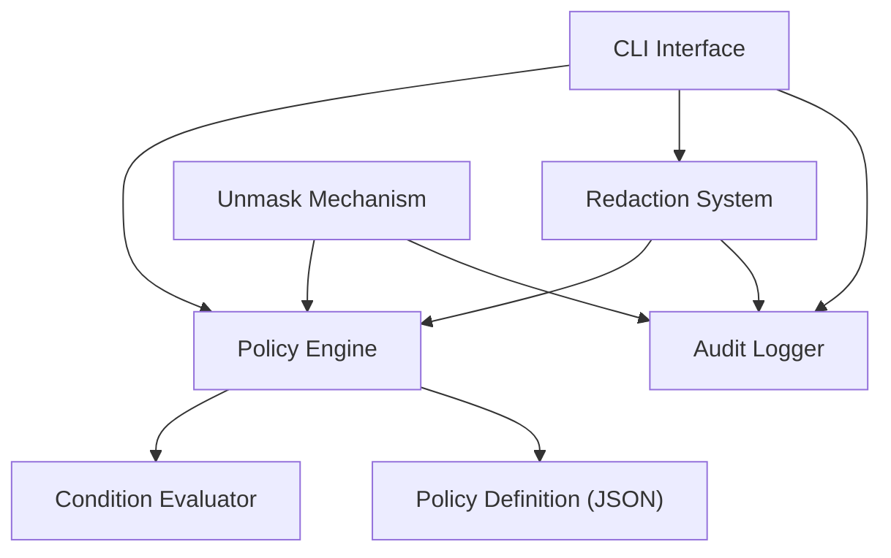

# Marvis Vault OSS - System Analysis & Development Brief

## Executive Summary

**Marvis Vault OSS** is a programmable compliance infrastructure for AI systems that provides secure handling of sensitive data through redaction, simulation, and audit capabilities. This is a **working open-source project** with a complete implementation and comprehensive documentation.

## System Overview

### Core Value Proposition
- **Redaction Engine**: Mask sensitive fields using role + trustScore
- **Policy Language**: Declarative conditions with `&&`, `||`, and field logic  
- **Simulation CLI**: Preview masking before applying to production
- **Audit Logging**: Structured JSONL logs for compliance
- **Python SDK**: Integration with AI agents and pipelines
- **Policy Templates**: Ready-to-use GDPR, PII, finance, healthcare policies

### Target Users
- AI startups building agent copilots
- Compliance-conscious LLM applications
- Enterprises evaluating secure AI stacks
- Open-source developers securing pipelines

## Technical Architecture

### Tech Stack
- **Language**: Python 3.10+ (minimum 3.11.9 recommended)
- **CLI Framework**: Typer
- **Validation**: Pydantic + safe condition parser (no eval)
- **Output**: Rich terminal formatting, structured JSONL logs
- **Testing**: pytest, mypy, black, isort

### Core Components



## Current Implementation Status

### Fully Implemented
1. **CLI Interface** (`vault/cli/`) - Complete command suite
2. **Policy Engine** (`vault/engine/`) - Policy parsing and evaluation
3. **Condition Evaluator** - Expression parsing with logical operators
4. **Redaction System** (`vault/sdk/redact.py`) - JSON and text masking
5. **Unmask Mechanism** (`vault/sdk/unmask.py`) - Authorized data reveal
6. **Audit System** (`vault/audit/`) - Event logging and trust reports
7. **Policy Templates** (`vault/templates/`) - GDPR, PII, healthcare, finance

### Architecture Components

#### 1. CLI Interface (`vault/cli/main.py`)
- Entry point: `vault` command
- Subcommands: `redact`, `simulate`, `audit`, `lint`, `diff`, `dry-run`
- Rich terminal output with error handling
- File I/O handling for JSON/YAML policies

#### 2. Policy Engine (`vault/engine/policy_engine.py`)
- Role-based access control
- Condition evaluation pipeline
- Integration with condition evaluator
- Decision making with explanations

#### 3. Redaction System (`vault/sdk/redact.py`)
- JSON structure traversal
- Text pattern matching
- Field masking with `[REDACTED]` markers
- Audit trail generation

#### 4. Audit System (`vault/audit/`)
- Structured JSONL logging
- Trust report generation
- Event validation and formatting
- CLI tools for log analysis

## Policy Definition System

### Policy Structure
```json
{
  "mask": ["ssn", "creditCard", "medicalHistory"],
  "unmask_roles": ["doctor", "nurse", "admin"], 
  "conditions": [
    "role == 'doctor' && department == patient_department",
    "role == 'nurse' && emergency == true",
    "role == 'admin' && audit_mode == true"
  ]
}
```

### Condition Language
- **Operators**: `==`, `!=`, `>`, `<`, `>=`, `<=`
- **Logic**: `&&` (AND), `||` (OR)
- **Context Variables**: role, trustScore, department, etc.
- **Safe Evaluation**: No `eval()` - custom parser prevents injection

## Running Locally

### Installation Steps
```bash
# 1. Clone repository
git clone https://github.com/marvislabs/marvis-vault-oss.git
cd marvis-vault-oss

# 2. Create virtual environment
python -m venv .venv
source .venv/bin/activate  # Linux/Mac
# OR
.venv\Scripts\Activate.ps1  # Windows

# 3. Install in development mode
pip install -e ".[dev]"

# 4. Verify installation
vault --help
```

### Common Commands
```bash
# Redact sensitive data
vault redact --input examples/agents/agent.json --policy vault/templates/pii-basic.json --output redacted.json

# Simulate policy effects
vault simulate --agent examples/agents/agent.json --policy vault/templates/pii-basic.json

# Validate policy syntax
vault lint --policy vault/templates/pii-basic.json

# View audit logs
vault audit --log logs/audit_log.jsonl

# Run tests
pytest tests/ -v
```

## Development Areas & Next Steps

### What's Built vs What Could Be Enhanced

#### Core Functionality (Complete)
- Policy-based redaction system
- Role-based access control
- Condition evaluation engine
- Audit logging and reporting
- CLI tools for all operations
- SDK for programmatic use

#### Potential Enhancements (OSS vs Vault Plus)
The documentation clearly indicates **OSS vs Vault Plus** distinction:

**OSS (Current)**:
- Policy engine (mask, simulate)
- Full CLI + Python SDK

**Vault Plus (Commercial)**:
- Hosted API (FastAPI)
- Secure role-based unmasking
- Interactive TUI playground
- Telemetry + usage analytics
- Policy Marketplace

### Development Opportunities

#### 1. **Vault Plus Features to Build**
- **FastAPI Server**: REST API for hosted deployment
- **TUI Interface**: Interactive terminal playground using Rich/Textual
- **Policy Marketplace**: Community policy sharing platform
- **Usage Analytics**: Telemetry collection and dashboards
- **Enhanced Unmasking**: More secure role-based reveal mechanisms

#### 2. **OSS Enhancements**
- **More Policy Templates**: Industry-specific compliance templates
- **Enhanced CLI**: Better error messages, progress bars
- **Integration Examples**: Sample code for popular AI frameworks
- **Documentation**: More use case examples and tutorials

#### 3. **Community Features**
- **GitHub Actions**: CI/CD workflows
- **Docker Support**: Containerized deployment
- **Helm Charts**: Kubernetes deployment
- **Example Integrations**: LangChain, OpenAI, etc.

## Testing & Quality

### Current Test Suite
Located in `tests/`:
- `test_redact_command.py` - CLI redaction testing
- `test_simulate_command.py` - Policy simulation testing  
- `test_lint_command.py` - Policy validation testing

### Quality Tools
```bash
# Run tests with coverage
pytest tests/ -v --cov=vault --cov-report=term-missing

# Code formatting
black vault/

# Type checking
mypy vault/

# Linting
pylint vault/
```

## Key Files to Understand

### Core Implementation
- `vault/cli/main.py` - CLI entry point and command registration
- `vault/engine/policy_engine.py` - Policy evaluation logic
- `vault/engine/condition_evaluator.py` - Expression parsing and evaluation
- `vault/sdk/redact.py` - Data redaction implementation
- `vault/sdk/unmask.py` - Data unmasking implementation
- `vault/audit/audit_logger.py` - Event logging system

### Configuration & Templates
- `vault/templates/` - Pre-built policy templates
- `examples/agents/` - Sample agent configurations
- `pyproject.toml` - Build configuration
- `requirements.txt` - Python dependencies

## Project Maturity Assessment

### Strengths
- **Complete Architecture**: All major components implemented
- **Comprehensive Documentation**: 8 detailed tutorial chapters
- **Working CLI**: Full command suite with Rich output
- **Test Coverage**: Core functionality tested
- **Clear Roadmap**: OSS vs Plus features defined

### Production Readiness
- **Core Functionality**: Ready for use
- **CLI Tools**: Production-ready commands
- **Documentation**: Comprehensive guides
- **Scale Testing**: May need performance validation
- **Security Hardening**: Should audit for production security

## Conclusion

**Marvis Vault OSS is a mature, working system** ready for:
1. **Immediate Use**: CLI tools and SDK work out-of-the-box
2. **Extension**: Clear architecture for adding features
3. **Production Deployment**: With appropriate testing and hardening
4. **Community Contribution**: Well-documented codebase

The system demonstrates a clear understanding of compliance needs in AI systems and provides a solid foundation for building more advanced features in the commercial "Vault Plus" offering.