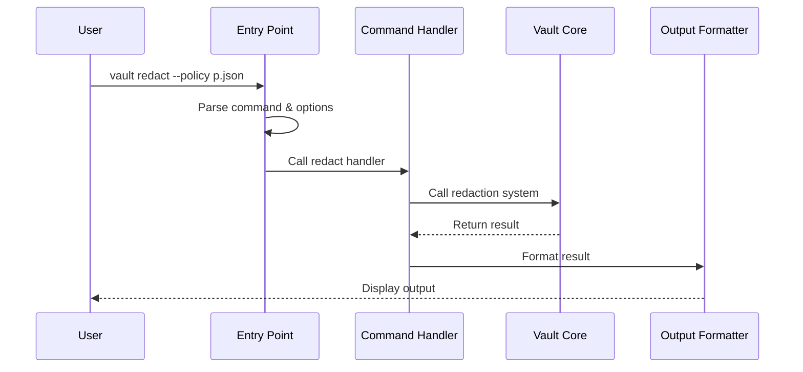

# Marvis Vault OSS CLI Quick Start

> Before you start check out our [Local Setup Guide](../SETUP.md)

Let's explore how to interact with all these powerful features through the **CLI Interface** - your command center for the marvis-vault-oss toolkit!

## Introduction: What is the CLI Interface?

Imagine you're a spacecraft pilot. You don't need to understand all the intricate details of how the engines work - you just need a control panel with clearly labeled buttons to operate your ship effectively.

The Command-Line Interface (CLI) in marvis-vault-oss serves exactly this purpose - it's your control panel with different "buttons" (commands) that let you interact with the vault system without writing code. This makes powerful data protection features accessible to everyone, even if you're not a programmer.

## Real-World Example: Security Compliance Check

Let's start with a real-world scenario:

> *Sarah is a security compliance officer at a healthcare company. She needs to verify that patient data is being properly protected before releasing it to a research team. She wants to check if the current data protection policy works as expected, apply it to some sample files, and review the audit logs.*

Without the CLI, Sarah would need to write custom code to interact with different parts of the vault system. With the CLI, she can do all of this using simple commands!

## Key Components of the CLI Interface

The CLI Interface in marvis-vault-oss has these main components:

1. **Entry Point** - The main command (`vault`) that provides access to all functionality
2. **Commands** - Specific operations like `redact`, `simulate`, or `audit`
3. **Options & Flags** - Modifiers that control how commands behave
4. **Input/Output Handling** - Ways to provide data and receive results

Let's explore each of these components.

## Using the CLI Interface

### Getting Started

You can access all vault functionality through the main `vault` command. To see available commands:

```bash
python -m vault.cli --help
```

This displays a help message showing all available commands:

```
Marvis Vault - Programmable compliance infrastructure for agentic AI.

Options:
  -v, --version  Show version and exit
  --help         Show this message and exit.

Commands:
  audit     View and export audit logs
  diff      Compare two policy files
  dry-run   Test policy changes safely
  lint      Validate policy files
  redact    Redact sensitive data from text using a policy
  simulate  Simulate policy evaluation on sample data
```

### Redacting Sensitive Data

Let's help Sarah redact sensitive information from a patient record:

```bash
python -m vault.cli redact --policy policies/patient.json --input data.json --output redacted.json
```

This command:
1. Reads the policy from `policies/patient.json`
2. Takes input data from `data.json`
3. Applies redaction based on the policy
4. Writes the result to `redacted.json`

To also create an audit log of what was redacted:

```bash
python -m vault.cli redact --policy policies/patient.json --input data.json --audit audit.json
```

### Validating Policies

Before applying a policy, Sarah can check if it's valid:

```bash
python -m vault.cli lint --policy policies/patient.json
```

This validates the policy structure and checks for common issues. The output might look like:

```
┌─────────────────────┐
│ Validation Result   │
└─────────────────────┘
Policy is valid!
```

Or if there are issues:

```
┌─────────┐
│ Errors  │
└─────────┘
 Missing required field: conditions

┌───────────────────────────────────────┐
│ Found 1 error(s) and 0 warning(s)     │
└───────────────────────────────────────┘
```

### Simulating Policy Effects

Sarah can also check what would happen if a specific user tried to access protected data:

```bash
python -m vault.cli simulate --policy policies/patient.json --agent agents/doctor.json
```

The `agents/doctor.json` file contains a role and other context:

```json
{
  "role": "doctor",
  "trustScore": 95,
  "department": "cardiology"
}
```

The output shows what would happen with this access attempt:

```
Policy Evaluation Results
┌─────────┐
│ Result  │
└─────────┘
Role allowed access and all conditions met

Masking Analysis
┌─────────────────────────────────────────────────┐
│ Masking Analysis                                │
├────────┬─────────┬──────────────────────────────┤
│ Status │                                        │
├────────┼─────────┼──────────────────────────────┤
│ No fields would be masked - all conditions met  │
└────────┴─────────┴──────────────────────────────┘
```

### Viewing Audit Logs

After performing some operations, Sarah can review the audit logs:

```bash
python -m vault.cli audit --log logs/audit_log.jsonl
```

This shows a summary of all data access events:

```
┌─────────────────────┐
│ Audit Log Summary   │
└─────────────────────┘
Total Entries: 24
Unique Roles: 3
Unique Actions: 2
Unique Fields: 5
Time Range: 2023-07-15 09:12:34 to 2023-07-15 15:45:22
```

For more details, she can add the `--all` flag:

```bash
python -m vault.cli audit --log logs/audit_log.jsonl --all
```

## How the CLI Interface Works

When you run a CLI command, several steps happen behind the scenes:

1. The main entry point parses your command and arguments
2. It routes your request to the appropriate handler
3. The handler performs the requested operation
4. Results are formatted and displayed

Let's visualize this process:



## Under the Hood: Main CLI Structure

The CLI Interface is built using the Typer library, which makes it easy to create command-line applications. Here's a simplified version of the main CLI structure:

```python
# From vault/cli/main.py
import typer
from .redact import redact
from .audit import audit
from .lint import lint

app = typer.Typer(name="vault", help="Programmable compliance infrastructure")

# Register all commands
app.command(name="redact", help="Redact sensitive data")(redact)
app.command(name="audit", help="View audit logs")(audit)
app.command(name="lint", help="Validate policy files")(lint)
```

This code creates the main `vault` command and registers subcommands like `redact`, `audit`, and `lint`. Each subcommand is defined in its own module.

## Command Implementation: Redaction

Let's look at a simplified version of the redaction command:

```python
# From vault/cli/redact.py
import typer
from ..sdk.redact import redact as sdk_redact

app = typer.Typer()

@app.command()
def redact(
    input: Path = typer.Option(..., "--input", "-i", help="Input file path"),
    policy: Path = typer.Option(..., "--policy", "-p", help="Policy file path"),
    output: Path = typer.Option(..., "--output", "-o", help="Output file path"),
):
    # Read input and policy
    input_content = input.read_text()
    policy_content = json.loads(policy.read_text())
    
    # Apply redaction
    result = sdk_redact(input_content, policy_content)
    
    # Write output
    output.write_text(result.content)
```

This function:
1. Defines command-line options for input, policy, and output
2. Reads the input and policy files
3. Calls the redaction SDK function to do the actual work
4. Writes the result to the output file

## Error Handling

The CLI provides consistent error handling across all commands:

```python
# From vault/cli/main.py
def run():
    """Entry point for the CLI."""
    try:
        app()
    except Exception as e:
        console.print(
            Panel(
                f"[red]Error:[/red] {str(e)}",
                title="[bold red]Marvis Vault Error[/bold red]",
                border_style="red",
            )
        )
        sys.exit(1)
```

This catches any errors that occur during command execution and displays them in a user-friendly format with clear red highlighting.

## Rich Output Formatting

The CLI uses the Rich library to create beautiful, colorful terminal output:

```python
# From vault/cli/lint.py
def format_validation_results(errors, warnings):
    if errors:
        error_table = Table(title="Errors", style="red")
        error_table.add_column("Error", style="red")
        for error in errors:
            error_table.add_row(error)
        console.print(error_table)
    else:
        console.print(Panel(
            "[green]Policy is valid![/green]",
            title="Validation Result"
        ))
```

This code formats validation results into tables with colored text, making it easy to identify errors and warnings at a glance.

## Complete Usage Example

Let's put it all together with a complete workflow for Sarah's security compliance check:

```bash
# 1. Validate the policy
python -m vault.cli lint --policy policies/patient.json

# 2. Simulate policy effect for a doctor
python -m vault.cli simulate --policy policies/patient.json --agent agents/doctor.json

# 3. Apply redaction to patient data with audit log
python -m vault.cli redact --policy policies/patient.json --input patient_data.json \
  --output redacted_data.json --audit redaction_audit.json

# 4. Review the audit log
python -m vault.cli audit --log redaction_audit.json
```

This workflow allows Sarah to:
1. Verify the policy is valid
2. Check that doctors can access the data as expected
3. Apply the policy to patient data, creating a redacted version
4. Review what was redacted in the audit log

## Extending the CLI

The modular design of the CLI makes it easy to add new commands. To add a custom command:

```python
# In your_command.py
import typer

app = typer.Typer()

@app.command()
def your_command(
    option1: str = typer.Option(..., "--option1", help="Description"),
):
    # Your command implementation
    print(f"Running with option1={option1}")

# In main.py
from .your_command import your_command
app.command(name="custom", help="Your custom command")(your_command)
```

This extensibility allows organizations to adapt the CLI to their specific needs.

## Best Practices for Using the CLI

1. **Use Full Paths**: Always provide full paths to files to avoid confusion.

2. **Validate First**: Use the `lint` command to check policies before applying them.

3. **Audit Everything**: Use the `--audit` flag with redaction operations to maintain records.

4. **Script Common Operations**: Create shell scripts for frequently used command sequences.

5. **Test Changes Safely**: Use `simulate` and `dry-run` to test changes before applying them.

## Conclusion

The CLI Interface provides a powerful yet user-friendly way to interact with all aspects of the marvis-vault-oss system. It allows users like Sarah to perform complex data protection operations without writing code, simply by using familiar command-line tools.

In this chapter, we've learned:
- How to use the CLI to redact sensitive data, validate policies, and review audit logs
- The structure of CLI commands and options
- How the CLI works internally to route commands and handle errors
- Best practices for using the CLI effectively

You now have a solid understanding of the Quickstart! If you want to learn more go to [Tutorial](01_index.md).

Want to contribute? ➡️ [Start here](../CONTRIBUTING.md)

---
