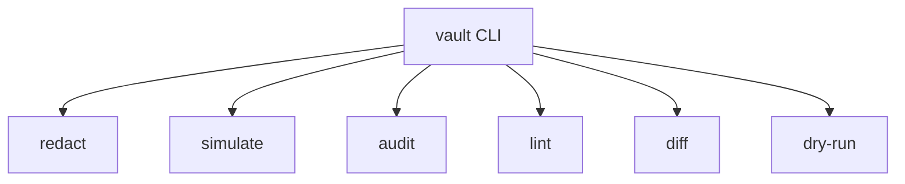
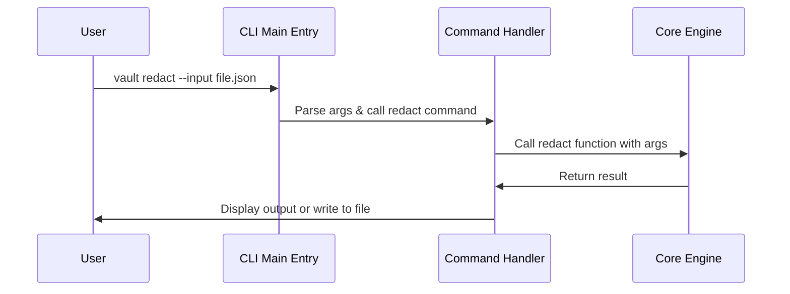

# Chapter 1: CLI Interface

## Introduction: Your Control Panel for Marvis Vault

Imagine you have a powerful security system for your data, but you need a simple way to control it without writing code. That's exactly what the Command Line Interface (CLI) provides for Marvis Vault. Think of it as a control panel with different buttons (commands) that let you interact with the system.

In this chapter, we'll explore how to use the CLI to accomplish common tasks like redacting sensitive information, validating policies, and reviewing audit logs.

## What is a CLI Interface?

A Command Line Interface is a text-based way to interact with a program by typing commands. Unlike graphical interfaces with buttons and menus, CLIs use text commands that you type into a terminal or command prompt.

For example, instead of clicking a "Redact" button in a window, you would type a command like:

```bash
vault redact --input secret_data.txt --policy my_policy.json --output safe_data.txt
```

## The Marvis Vault CLI Structure

The Marvis Vault CLI is organized into several commands, each serving a specific purpose:

1. `redact` - Hides sensitive information based on policies
2. `simulate` - Tests what a policy would do without actually applying it
3. `audit` - Reviews logs of past actions
4. `lint` - Checks if your policy files are valid
5. `diff` - Compares two policy files to see what changed
6. `dry-run` - Tests policy changes safely

Let's look at a simple diagram of how these commands fit together:



## Getting Started: Basic Usage

To use any command in the Marvis Vault CLI, you start with the word `vault` followed by the command name and any options you need.

Let's try the simplest example - checking the version:

```bash
vault --version
```

This will display the current version of Marvis Vault.

## A Practical Example: Redacting Sensitive Data

Let's walk through a common use case: you have a document with sensitive information that you want to redact (hide) before sharing it.

### Step 1: Create a sample document

Create a file named `example.json` with some sensitive data:

```json
{
  "name": "John Doe",
  "ssn": "123-45-6789",
  "address": "123 Main St"
}
```

### Step 2: Create a simple policy

Create a file named `policy.json` that defines what should be redacted:

```json
{
  "mask": ["ssn"],
  "unmask_roles": ["admin"],
  "conditions": ["role == 'user'"]
}
```

This policy says: "Redact the SSN field if the user's role is 'user'."

### Step 3: Run the redact command

Now use the CLI to apply the policy:

```bash
vault redact --input example.json --policy policy.json --output safe.json
```

### Step 4: Check the result

The output file `safe.json` should look like:

```json
{
  "name": "John Doe",
  "ssn": "[REDACTED]",
  "address": "123 Main St"
}
```

## Common CLI Options

Most commands support several options to customize their behavior:

- `--input` or `-i`: Specifies the input file
- `--output` or `-o`: Specifies where to save the result
- `--policy` or `-p`: Points to your policy file
- `--force` or `-f`: Overwrites existing files without asking
- `--help`: Shows help for a specific command

You can check the available options for any command by adding `--help`:

```bash
vault redact --help
```

## Understanding How the CLI Works Internally

When you run a vault command, a sequence of events happens behind the scenes:



Let's look at how this is implemented in the code. First, the main CLI structure in `vault\cli\main.py`:

```python
app = typer.Typer(
    name="vault",
    help="Programmable compliance infrastructure for agentic AI",
    add_completion=False,
    no_args_is_help=True,
)

# Register all commands
app.command(
    name="redact",
    help="Redact sensitive data from text using a policy",
)(redact)

# More commands registered similarly...
```

This code sets up the CLI application and registers each command. When you run a command, the appropriate function is called.

The entry point for the CLI is the `run()` function:

```python
def run():
    """Entry point for the CLI."""
    try:
        app()
    except Exception as e:
        console.print(
            Panel(
                f"[red]Error:[/red] {str(e)}",
                title="[bold red]Marvis Vault Error[/bold red]",
                border_style="red",
            )
        )
        sys.exit(1)
```

This function calls the Typer app and handles any errors that occur.

## Example Command Implementation: Redact

Let's look at how the `redact` command is implemented in `vault\cli\redact.py`:

```python
@app.command()
def redact(
    input: Optional[Path] = typer.Option(
        None,
        "--input",
        "-i",
        help="Input file path. If not provided, reads from stdin.",
    ),
    policy: Path = typer.Option(
        ...,  # This means the option is required
        "--policy",
        "-p",
        help="Policy file path (JSON or YAML)",
    ),
    # More options...
) -> None:
    """Redact sensitive information from input based on policy rules."""
    # Implementation...
```

This function:
1. Defines the command options like `--input` and `--policy`
2. Provides help text for each option
3. Handles the actual redaction logic (not shown in this snippet)

The implementation follows these steps:
1. Read the policy file
2. Read the input data
3. Apply the policy to redact sensitive information
4. Write the result to the output location
5. Optionally create an audit log

## Audit Command Example

Another useful command is `audit`, which lets you review logs of past actions:

```bash
vault audit --log logs/audit_log.jsonl
```

This command reads the audit log file and displays a summary, such as:

```
Audit Log Summary
----------------
Total Entries: 25
Unique Roles: 3
Unique Actions: 2
Time Range: 2023-06-01 10:00:00 to 2023-06-02 15:30:00
```

## Conclusion

The CLI Interface provides a convenient way to interact with Marvis Vault without writing code. You can use various commands to redact sensitive data, test policies, and review audit logs.

In this chapter, we've learned:
- What the CLI Interface is and its purpose
- Basic usage of the CLI commands
- How to redact sensitive information using the CLI
- How the CLI works internally

Now that you understand how to interact with Marvis Vault through the CLI, we can move on to learning about how to define policies in the next chapter: [Policy Definition](02_policy_definition_.md).

---
