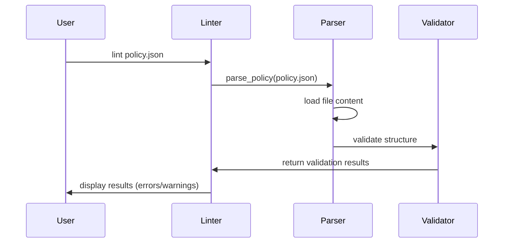

# Chapter 1: Policy Definition

## Introduction

Imagine you're in charge of protecting sensitive data in your organization's applications. How do you decide which data should be hidden, who should be allowed to see it, and under what circumstances? This is where **Policy Definition** comes in!

In this chapter, we'll learn about Policy Definition in the marvis-vault-oss project - the foundation of our data protection system. Think of a Policy Definition as a set of rules, similar to a security guard's instructions: "Hide these specific items, only show them to these authorized people, and only when these specific conditions are met."

## Why Do We Need Policies?

Let's consider a simple example: a medical records application. Patient data contains sensitive information like:

- Patient name
- Date of birth
- Social Security Number
- Medical diagnosis
- Medications

While doctors need full access to this information, other staff like receptionists or billing clerks should only see certain fields. How do we control that? With a Policy Definition!

## Key Components of a Policy

A Policy Definition in marvis-vault-oss has three essential components:

1. **Fields to mask** - What information should be hidden?
2. **Unmask roles** - Who is allowed to see the hidden information?
3. **Conditions** - Under what circumstances can the information be revealed?

Let's break these down one by one.

### Fields to Mask

These are the specific data fields that contain sensitive information and should be hidden by default. For our medical records example:

```json
{
  "mask": ["ssn", "diagnosis", "medications"]
}
```

This part of the policy tells the system to hide the Social Security Number, diagnosis, and medications.

### Unmask Roles

This component lists the user roles that are authorized to see the masked information:

```json
{
  "unmask_roles": ["doctor", "nurse", "pharmacist"]
}
```

This means doctors, nurses, and pharmacists can potentially see the hidden information.

### Conditions

Conditions specify the exact circumstances under which masked data can be revealed, even to authorized roles:

```json
{
  "conditions": [
    "role == 'doctor'",
    "patientConsent == true"
  ]
}
```

These conditions state that:
1. The user must have the role 'doctor'
2. The patient must have given consent

Both conditions must be satisfied for the masked data to be revealed.

## Creating a Complete Policy

Let's put it all together to create a complete policy definition for our medical records example:

```json
{
  "mask": ["ssn", "diagnosis", "medications"],
  "unmask_roles": ["doctor", "nurse", "pharmacist"],
  "conditions": [
    "role == 'doctor'",
    "patientConsent == true"
  ]
}
```

This policy can be stored as a JSON file (as shown above) or as a YAML file:

```yaml
mask:
  - ssn
  - diagnosis
  - medications
unmask_roles:
  - doctor
  - nurse
  - pharmacist
conditions:
  - role == 'doctor'
  - patientConsent == true
```

## Validating Your Policy

It's important to make sure your policy is correct before using it. The marvis-vault-oss project includes a linting tool to check for common errors:

```bash
python -m vault.cli.lint --policy my_policy.json
```

The linter checks for issues like:
- Missing required fields
- Incorrect data types
- Empty lists
- Potentially problematic conditions

Here's how the validation works under the hood:



## How Policy Definition Works Internally

When you create a policy file, the system needs to parse and validate it before using it. Let's look at how this happens:

1. **Loading the Policy File**: The system reads your JSON or YAML file.

2. **Parsing the Content**: The content is converted into a structured format.

3. **Validation**: The system checks if all required components are present and correctly formatted.

Here's a simplified version of the code that handles this:

```python
def parse_policy(file_path):
    # Read the file
    path = Path(file_path)
    content = path.read_text()
    
    # Parse based on file format
    if path.suffix == '.json':
        data = json.loads(content)
    elif path.suffix in ['.yaml', '.yml']:
        data = yaml.safe_load(content)
    
    # Validate using Pydantic model
    policy = Policy(**data)
    return policy
```

The `Policy` class uses Pydantic to ensure that the data matches the expected structure:

```python
class Policy(BaseModel):
    mask: List[str]
    unmask_roles: List[str]
    conditions: List[str]
```

This ensures that your policy contains all the necessary components and that they're correctly formatted.

## Comparing Policy Changes

As your application evolves, you might need to update your policies. The marvis-vault-oss project includes a tool to compare different versions of a policy:

```bash
python -m vault.cli.diff --before old_policy.json --after new_policy.json
```

This shows you what changed between versions, including:
- Added or removed fields to mask
- Added or removed roles
- Changes to conditions

## Best Practices for Writing Policies

When creating your policies, keep these tips in mind:

1. **Be specific**: Only mask fields that truly contain sensitive data.

2. **Limit access**: Only include roles that absolutely need access in the unmask_roles list.

3. **Clear conditions**: Make conditions easy to understand and not overly complex.

4. **Regular reviews**: Review and update your policies as your application and requirements change.

5. **Test thoroughly**: Make sure your policies work as expected in different scenarios.

## Conclusion

Policy Definition is the foundation of the data protection system in marvis-vault-oss. It allows you to specify which data to protect, who can access it, and under what conditions.

In this chapter, we learned:
- The three essential components of a Policy Definition
- How to create a policy in JSON or YAML format
- How to validate a policy using the built-in linter
- How policies are processed internally by the system

With a solid understanding of Policy Definition, we're ready to move on to see how these policies are actually enforced by the [Policy Engine](02_policy_engine_.md).

---
