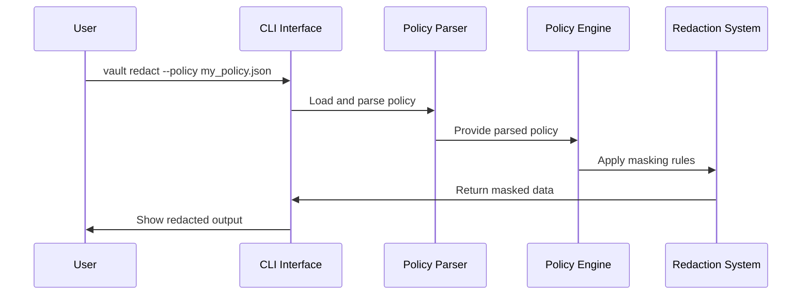

# Chapter 2: Policy Definition

## Introduction: Your Data Protection Rulebook

In [Chapter 1: CLI Interface](01_cli_interface_.md), we learned how to interact with Marvis Vault using commands. Now, let's dive into what makes those commands work: **Policy Definitions**.

Think of a policy definition as a rulebook that tells Marvis Vault exactly what data needs protection, who can see it, and under what conditions. Just like a security guard needs clear instructions about who to let into a building, Marvis Vault needs precise rules about what information to keep private.

In this chapter, we'll learn how to create these rulebooks and use them to protect sensitive information.

## Why Do We Need Policy Definitions?

Imagine you have a document containing customer information like names, credit card numbers, and addresses. You want to:

1. Hide credit card numbers from most employees
2. Allow managers to see those numbers when necessary
3. Keep a record of who viewed this sensitive information and why

Without clear rules, it would be impossible to automatically protect this data. Policy definitions solve this problem by providing a structured way to specify exactly what should be protected and who can access it.

## A Real-World Example

Let's start with a practical example: protecting patient information in a healthcare application.

Suppose we have patient records that look like this:

```json
{
  "patientName": "Jane Smith",
  "ssn": "123-45-6789",
  "diagnosis": "Common Cold",
  "contactNumber": "555-123-4567"
}
```

In healthcare, certain information (like SSNs) needs extra protection. We need to:
- Mask SSNs from regular staff
- Allow doctors to see full records
- Ensure nurses can see some information but not all

Let's see how a policy definition helps us achieve this.

## Components of a Policy Definition

A policy definition consists of three main parts:

1. **Fields to Mask**: What information needs to be hidden?
2. **Roles That Can Unmask**: Who is allowed to see the hidden information?
3. **Conditions**: Under what circumstances can the information be revealed?

Let's look at a simple policy file in JSON format:

```json
{
  "mask": ["ssn", "contactNumber"],
  "unmask_roles": ["doctor", "admin"],
  "conditions": ["role == 'doctor' && patient_consent == true"]
}
```

Let's break down what this means:

- `mask`: Hide both the SSN and contact number
- `unmask_roles`: Only doctors and admins can potentially see this information
- `conditions`: A doctor can only see the information if the patient has given consent

## Creating Your First Policy Definition

Creating a policy definition is simple - it's just a JSON or YAML file with specific fields. Let's create one from scratch:

### Step 1: Identify what needs protection

First, list all the sensitive fields in your data that need protection:
- Social Security Numbers (SSNs)
- Contact numbers
- Financial details
- Medical diagnoses

### Step 2: Create a basic policy file

Create a file named `patient_policy.json` with this content:

```json
{
  "mask": ["ssn"],
  "unmask_roles": ["doctor"],
  "conditions": ["purpose == 'treatment'"]
}
```

This simple policy:
- Masks only the SSN field
- Allows doctors to see the SSN
- Requires the purpose to be 'treatment' for unmasking to occur

### Step 3: Add more fields and complex conditions

As your needs grow, you can add more fields and conditions:

```json
{
  "mask": ["ssn", "contactNumber"],
  "unmask_roles": ["doctor", "nurse", "admin"],
  "conditions": [
    "role == 'doctor'", 
    "role == 'nurse' && department == 'emergency'"
  ]
}
```

This updated policy now:
- Protects both SSN and contact number
- Gives access to doctors, nurses, and admins
- Allows doctors to always see the information
- Allows nurses to see the information only if they work in the emergency department

## Testing Your Policy Definition

Before applying a policy in a production environment, it's important to test it. We can use the `lint` command from the [CLI Interface](01_cli_interface_.md) to check for errors:

```bash
vault lint --policy patient_policy.json
```

If everything is correct, you'll see:

```
Policy is valid!
```

If there are problems, you'll get helpful error messages explaining what to fix.

## Understanding the Policy Structure

Let's take a deeper look at what each section of a policy means:

### 1. Fields to Mask (`mask`)

This is an array of field names that should be hidden or redacted in your data. These fields will be replaced with "[REDACTED]" or another placeholder when the data is processed.

```json
"mask": ["ssn", "creditCard", "address"]
```

### 2. Roles That Can Unmask (`unmask_roles`)

This array lists the roles that are allowed to potentially see the masked information. Note that having the correct role doesn't automatically grant access - the conditions must also be met.

```json
"unmask_roles": ["admin", "manager", "auditor"]
```

### 3. Conditions (`conditions`)

Conditions are expressions that must evaluate to true for unmasking to occur. They define the precise circumstances under which someone with the right role can see the masked information.

```json
"conditions": [
  "role == 'admin'",
  "role == 'manager' && department == 'finance'"
]
```

These conditions use simple expressions with:
- Comparison operators (`==`, `!=`, `>`, `<`, `>=`, `<=`)
- Logical operators (`&&` for AND, `||` for OR)

## How Policies Work Behind the Scenes

When you apply a policy to redact sensitive information, here's what happens internally:



Let's look at the code that handles policy parsing in `vault\engine\policy_parser.py`:

```python
def load_policy(file_path: Union[str, Path]) -> Dict[str, Any]:
    """Load and validate a policy file."""
    path = Path(file_path)
    if not path.exists():
        raise FileNotFoundError(f"Policy file not found: {file_path}")
    
    try:
        content = path.read_text()
        if path.suffix.lower() in ['.json']:
            data = json.loads(content)
        elif path.suffix.lower() in ['.yaml', '.yml']:
            data = yaml.safe_load(content)
        else:
            raise ValueError(f"Unsupported file format: {path.suffix}")
        
        # Validate using Pydantic model
        policy = Policy(**data)
        return policy.model_dump()
    # Error handling code...
```

This function:
1. Takes a file path as input
2. Reads the file content
3. Parses it as JSON or YAML based on the file extension
4. Validates the structure using a Pydantic model
5. Returns the parsed policy if valid

The actual policy is modeled with a Pydantic class for validation:

```python
class Policy(BaseModel):
    """Represents a complete policy document."""
    mask: List[str] = Field(..., description="Fields to mask")
    unmask_roles: List[str] = Field(..., description="List of roles that can unmask")
    conditions: List[str] = Field(..., description="List of conditions that must be met")
```

## Validating Policies

The `vault lint` command checks policies for errors. Let's see how this works in `vault\cli\lint.py`:

```python
def validate_required_fields(policy: Policy) -> List[str]:
    """Validate that all required fields exist."""
    errors = []
    missing_fields = REQUIRED_FIELDS - set(policy.model_dump().keys())
    if missing_fields:
        errors.append(f"Missing required fields: {', '.join(missing_fields)}")
    return errors
```

This function checks if any required fields are missing from your policy.

The linter also checks for:
- Correct data types (lists where expected)
- Non-empty lists where required
- Potential issues like overly permissive conditions

## Advanced Policy Examples

As you become more comfortable with policies, you can create more advanced ones:

### Example: Multi-Level Access Control

```json
{
  "mask": ["ssn", "creditCard", "medicalHistory"],
  "unmask_roles": ["doctor", "nurse", "admin"],
  "conditions": [
    "role == 'doctor' && department == patient_department",
    "role == 'nurse' && emergency == true",
    "role == 'admin' && audit_mode == true"
  ]
}
```

This policy creates different access levels:
- Doctors can see information only for patients in their department
- Nurses can see information only in emergency situations
- Admins can see information only during audits

### Example: Time-Based Access

```json
{
  "mask": ["financialData"],
  "unmask_roles": ["accountant", "manager"],
  "conditions": [
    "role == 'accountant' && current_time >= '9:00' && current_time <= '17:00'",
    "role == 'manager'"
  ]
}
```

This policy:
- Allows accountants to see financial data only during business hours (9 AM to 5 PM)
- Allows managers to see financial data at any time

## Common Policy Definition Mistakes

When working with policies, watch out for these common pitfalls:

1. **Missing required fields**: Every policy must include `mask`, `unmask_roles`, and `conditions`.

2. **Empty lists**: The `unmask_roles` and `conditions` lists can't be empty.

3. **Incorrect syntax in conditions**: Make sure your condition expressions follow the correct syntax.

4. **Overly permissive policies**: Be cautious with conditions that use `||` (OR) operators or wildcard (`*`) roles.

5. **Missing context variables**: Ensure that variables used in conditions (like `department` or `emergency`) will be available in the context when the policy is evaluated.

## Using Policies with the CLI

Let's revisit how to use your policy with the Marvis Vault CLI:

```bash
vault redact --input patient_data.json --policy patient_policy.json --output safe_data.json
```

This command:
1. Takes your input data from `patient_data.json`
2. Applies the rules defined in `patient_policy.json`
3. Writes the redacted (masked) output to `safe_data.json`

## Conclusion

In this chapter, we've learned:
- What policy definitions are and why they're important
- How to create policies with mask fields, roles, and conditions
- How to validate policies for correctness
- How policies work behind the scenes
- How to avoid common policy definition mistakes

Policy definitions are the foundation of data protection in Marvis Vault. They define what data needs protection and who can access it under what circumstances. In the next chapter, [Policy Engine](03_policy_engine_.md), we'll learn how these policies are actually applied to your data to make decisions about masking and unmasking information.

---
