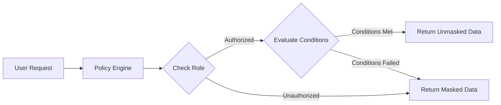
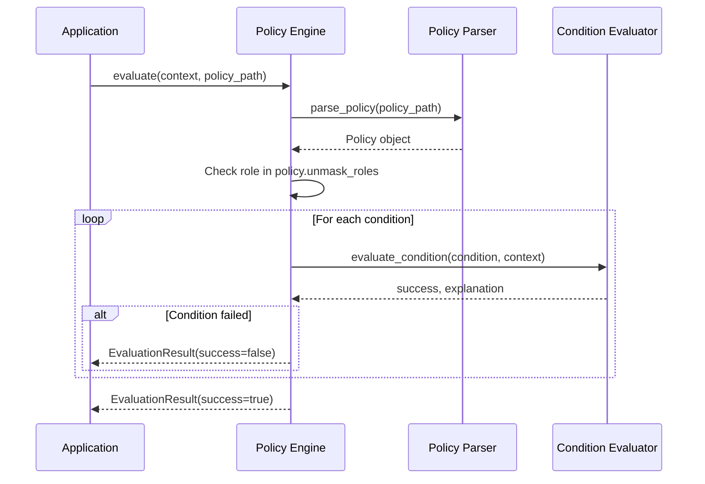

# Chapter 2: Policy Engine

In [Chapter 1: Policy Definition](01_policy_definition_.md), we learned how to create rules that specify which data should be protected, who can access it, and under what conditions. But how do these rules actually get enforced? This is where the **Policy Engine** comes in!

## Introduction

Think of the Policy Engine as a security guard at a checkpoint. The guard has a list of rules (our policy) and checks everyone's credentials before allowing them to access protected information. The Policy Engine does exactly this - it evaluates whether sensitive data should be masked or unmasked based on the rules we defined.

Let's continue with our medical records example from Chapter 1. We created a policy that masks certain fields (SSN, diagnosis, medications) and defined who can see this information (doctors, nurses, pharmacists) under specific conditions. Now we need to actually enforce this policy when someone tries to access patient records.

## How the Policy Engine Works

When someone requests access to patient data, the Policy Engine:

1. Checks if their role is authorized (Is this person a doctor, nurse, or pharmacist?)
2. Evaluates all conditions in the policy (Is the patient's consent given?)
3. Makes a decision: Should this person see the protected data or not?

Here's a simple diagram of this process:



## Using the Policy Engine

Let's see how to use the Policy Engine in code. Imagine we have a function that returns patient data. Before returning the data, we need to check if the current user should see the sensitive fields:

```python
from vault.engine.policy_engine import evaluate

def get_patient_data(patient_id, current_user):
    # First, retrieve the raw patient data
    patient_data = database.get_patient(patient_id)
    
    # Create the context for policy evaluation
    context = {
        "role": current_user.role,
        "patientConsent": patient_data.consent_given
    }
    
    # Evaluate the policy
    result = evaluate(context, "policies/patient_data.json")
```

The code above creates a context with information about the current situation (the user's role and whether the patient has given consent). Then it passes this context to the Policy Engine along with the path to our policy file.

The Policy Engine returns a result that tells us whether the user should see the unmasked data:

```python
# Check the result and mask data if needed
if not result.success:
    # Mask the sensitive fields
    for field in result.fields:
        patient_data[field] = "********"
    
    print(f"Some data was masked: {result.reason}")
    
return patient_data
```

If the evaluation fails, the Policy Engine tells us which fields should be masked. We can then replace the sensitive data with asterisks or another placeholder.

## Policy Evaluation in Detail

The Policy Engine evaluates our policy in two key steps:

### 1. Role Verification

First, it checks if the user's role is in the list of allowed roles. If not, the evaluation immediately fails:

```python
# Check role
if context.get("role") not in policy.unmask_roles:
    return EvaluationResult(
        success=False,
        reason=f"Role not in allowed roles",
        fields=policy.mask
    )
```

This is like the security guard checking your ID badge before you even state your business.

### 2. Condition Evaluation

If the role is authorized, the engine then evaluates each condition in the policy:

```python
# Evaluate conditions
for condition in policy.conditions:
    success, explanation = evaluate_condition(condition, context)
    if not success:
        return EvaluationResult(
            success=False,
            reason=f"Condition failed: {explanation}",
            fields=policy.mask
        )
```

Only if ALL conditions pass will the data be unmasked.

## What's Happening Inside the Policy Engine

Let's take a closer look at what happens step-by-step when we call the Policy Engine:



1. The application calls the Policy Engine with a context and policy path
2. The Policy Engine uses the [Policy Parser](01_policy_definition_.md) to load and parse the policy file
3. It first checks if the user's role is allowed
4. Then it uses the [Condition Evaluator](03_condition_evaluator_.md) to evaluate each condition
5. If any check fails, it returns a failure result
6. If all checks pass, it returns a success result

## Understanding Condition Evaluation

The [Condition Evaluator](03_condition_evaluator_.md) is a critical component that's used by the Policy Engine. It takes condition strings like `role == 'doctor'` and evaluates them against the context.

Here's a simplified version of how it works:

1. Parse the condition string into tokens (like "role", "==", "doctor")
2. Evaluate the tokens against the values in the context
3. Return the result and an explanation

For example, with the condition `patientConsent == true` and a context where `patientConsent` is `false`, the evaluator would:

1. Parse into tokens: `["patientConsent", EQUALS, true]`
2. Get the value of `patientConsent` from context: `false`
3. Compare: `false == true` is `false`
4. Return: `(false, "patientConsent == true is false")`

## Practical Example

Let's put it all together with our medical records example:

```python
# Our policy (from Chapter 1)
# {
#   "mask": ["ssn", "diagnosis", "medications"],
#   "unmask_roles": ["doctor", "nurse", "pharmacist"],
#   "conditions": [
#     "role == 'doctor'",
#     "patientConsent == true"
#   ]
# }

# Example 1: Doctor with patient consent
context1 = {
    "role": "doctor",
    "patientConsent": True
}

result1 = evaluate(context1, "patient_policy.json")
# result1.success is True - data will be unmasked
```

In this example, the user is a doctor (allowed role) and the patient has given consent. All conditions pass, so the sensitive data will be unmasked.

```python
# Example 2: Nurse with patient consent
context2 = {
    "role": "nurse",
    "patientConsent": True
}

result2 = evaluate(context2, "patient_policy.json")
# result2.success is False - data will remain masked
```

Here, even though the nurse is an allowed role and the patient has given consent, the condition `role == 'doctor'` fails. The data remains masked.

## The Policy Engine API

The main function in the Policy Engine is `evaluate()`, which takes:

1. `context`: A dictionary with values needed to evaluate conditions (like role, user ID, etc.)
2. `policy_path`: Path to the policy file (JSON or YAML)

It returns an `EvaluationResult` object with:
- `success`: Boolean indicating if the evaluation passed
- `reason`: String explaining why it passed or failed
- `fields`: List of fields that should be masked if success is False

```python
from vault.engine.policy_engine import evaluate, EvaluationResult

# Evaluate a policy
result = evaluate(context, "path/to/policy.json")

if result.success:
    print("Access granted!")
else:
    print(f"Access denied: {result.reason}")
    print(f"These fields will be masked: {result.fields}")
```

## Error Handling and Edge Cases

The Policy Engine is designed to handle various edge cases:

1. **Missing context values**: If a condition references a value not in the context, evaluation fails
2. **Invalid conditions**: If conditions have syntax errors, the evaluator raises an exception
3. **Circular references**: If conditions reference each other in a circular way, it detects and prevents infinite loops

For example, if your condition is `userTrustScore > 80` but `userTrustScore` isn't in the context:

```python
context = {
    "role": "admin"
    # Missing userTrustScore
}

try:
    result = evaluate(context, "policy.json")
except ValueError as e:
    print(f"Policy evaluation failed: {str(e)}")
    # This will show: "Context key 'userTrustScore' not found"
```

## Conclusion

The Policy Engine is the decision-maker in our data protection system. It takes the policies we defined and applies them to real-world situations to determine if sensitive data should be masked or unmasked.

In this chapter, we learned:
- How the Policy Engine evaluates policies against contextual information
- The step-by-step process of policy evaluation
- How to use the Policy Engine in code to protect sensitive data
- The inner workings of the evaluation process

With the Policy Engine, we can enforce our data protection rules consistently across our application. But how does it actually evaluate those complex conditions we've defined? In the next chapter, we'll dive into the [Condition Evaluator](03_condition_evaluator_.md), which is responsible for parsing and evaluating the condition expressions in our policies.

---
