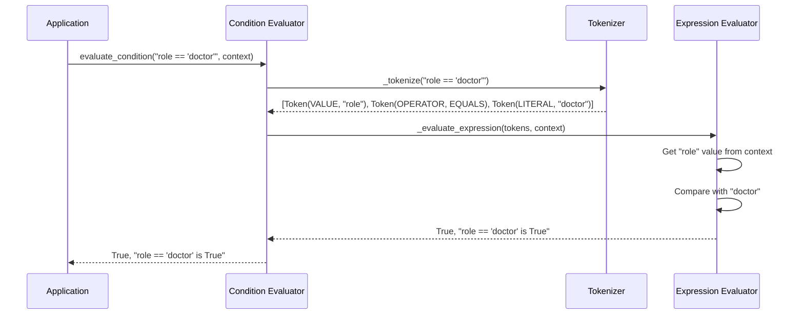

# Chapter 3: Condition Evaluator

In [Chapter 2: Policy Engine](02_policy_engine_.md), we saw how policies are enforced to protect sensitive data. At the heart of this enforcement is the **Condition Evaluator** - the component that determines whether a given condition is satisfied.

## Introduction: What is a Condition Evaluator?

Imagine you're a judge in a courthouse. You need to decide if someone meets specific legal criteria before granting them access to confidential documents. You review their credentials, check if they meet certain requirements, and then make a decision based on logical rules.

The Condition Evaluator works in a similar way. It takes a condition string like `role == 'admin' && trustScore > 80` and evaluates whether it's true or false based on the current context (like user information).

## Why Do We Need a Condition Evaluator?

Let's revisit our medical records example from previous chapters. We have a policy that includes conditions like:

```json
"conditions": [
  "role == 'doctor'",
  "patientConsent == true"
]
```

For the [Policy Engine](02_policy_engine_.md) to enforce these rules, it needs a way to understand and evaluate these condition strings. This is exactly what the Condition Evaluator does!

## Understanding Condition Expressions

Before we dive into using the Condition Evaluator, let's understand the types of conditions it can handle:

### 1. Simple Comparisons

```
role == 'doctor'
age > 18
patientConsent == true
```

These compare a value from the context (left side) with a literal value (right side).

### 2. Logical Operations

```
role == 'doctor' && patientConsent == true
role == 'admin' || trustScore > 90
```

These combine multiple conditions with logical AND (`&&`) or OR (`||`) operators.

### 3. Nested Conditions

```
(role == 'doctor' || role == 'nurse') && patientConsent == true
```

Parentheses allow grouping conditions to control the order of evaluation.

## Using the Condition Evaluator

Let's see how to use the Condition Evaluator with a simple example:

```python
from vault.engine.condition_evaluator import evaluate_condition

# Define a context with user information
context = {
    "role": "doctor",
    "patientConsent": True,
    "trustScore": 85
}

# Evaluate a simple condition
result, explanation = evaluate_condition("role == 'doctor'", context)
print(f"Result: {result}, Explanation: {explanation}")
```

This code checks if the user's role is 'doctor'. Since our context has `"role": "doctor"`, the result will be:

```
Result: True, Explanation: doctor == doctor is True
```

Let's try a more complex condition:

```python
# Evaluate a compound condition
condition = "role == 'doctor' && patientConsent == true"
result, explanation = evaluate_condition(condition, context)
print(f"Result: {result}, Explanation: {explanation}")
```

This evaluates both parts of the condition and combines them with AND. Both are true, so the result is:

```
Result: True, Explanation: (doctor == doctor is True) AND (True == true is True) is True
```

## How the Condition Evaluator Works

When you call `evaluate_condition()`, several steps happen behind the scenes:

1. **Tokenization**: The condition string is broken down into tokens (like `role`, `==`, `'doctor'`)
2. **Parsing**: Tokens are organized into a structure that can be evaluated
3. **Evaluation**: Each part is evaluated using values from the context
4. **Result**: A boolean result and explanation are returned

Let's visualize this process:



## Supported Operators

The Condition Evaluator supports several operators:

1. **Comparison Operators**:
   - `==` (equals)
   - `!=` (not equals)
   - `>` (greater than)
   - `<` (less than)

2. **Logical Operators**:
   - `&&` (logical AND)
   - `||` (logical OR)

Here's how you might use these operators:

```python
# Different operator examples
equals_result, _ = evaluate_condition("role == 'admin'", context)
not_equals_result, _ = evaluate_condition("role != 'guest'", context)
greater_than_result, _ = evaluate_condition("trustScore > 80", context)
logical_and_result, _ = evaluate_condition("role == 'doctor' && trustScore > 80", context)
```

## The Tokenization Process

Let's look at how condition strings are broken down into tokens. For example, the condition `role == 'admin'` is tokenized into:

1. `role` (a variable name to look up in the context)
2. `==` (the equals operator)
3. `'admin'` (a string literal)

Here's simplified code for how tokenization works:

```python
def _tokenize(condition):
    tokens = []
    i = 0
    
    while i < len(condition):
        char = condition[i]
        
        # Skip spaces
        if char.isspace():
            i += 1
            continue
            
        # Handle operators like ==, !=, &&, ||, >, <
        if char in ['&', '|', '=', '!', '>', '<']:
            # Code to identify operators
            # ...
        
        # Handle variable names
        elif char.isalpha():
            # Code to extract variable names
            # ...
```

This process transforms the text condition into structured tokens that can be evaluated.

## Evaluating Expressions

Once we have tokens, the evaluator processes them according to operator precedence rules. Here's a simplified version of how it works:

```python
def _evaluate_expression(tokens, context):
    # Handle simple comparison (x == y)
    if len(tokens) == 3 and tokens[1].type == TokenType.OPERATOR:
        left = tokens[0].value
        operator = tokens[1].value
        right = tokens[2].value
        
        # Get actual value if it's a context variable
        if tokens[0].type == TokenType.VALUE and isinstance(left, str):
            left = context.get(left)
            
        # Compare the values based on the operator
        if operator == Operator.EQUALS:
            result = left == right
            return result, f"{left} == {right} is {result}"
        # Handle other operators...
```

This is a very simplified view - the actual implementation handles nested expressions and more complex cases.

## Handling Complex Conditions

For complex conditions like `(role == 'admin' || role == 'manager') && trustScore > 80`, the evaluator recursively breaks them down:

1. First evaluate what's in parentheses: `(role == 'admin' || role == 'manager')`
2. Then evaluate the right side: `trustScore > 80`
3. Finally combine the results with the AND operator

This approach ensures that operator precedence is respected and complex conditions are correctly evaluated.

## Error Handling

The Condition Evaluator includes comprehensive error handling to help you identify problems:

```python
# Missing context variable
try:
    result, explanation = evaluate_condition("missingVar > 10", context)
except ValueError as e:
    print(f"Error: {e}")
    # Output: Error: Context key 'missingVar' not found
```

Some common errors it checks for:
- Missing context variables
- Invalid syntax in conditions
- Circular references
- Type errors (like comparing a string with > operator)

## Practical Example: Patient Data Access System

Let's build a more complete example. Imagine we're implementing access control for a patient records system:

```python
def can_access_patient_data(user, patient):
    # Create the context from user and patient information
    context = {
        "role": user.role,
        "department": user.department,
        "patientConsent": patient.has_given_consent,
        "isSameDoctor": (user.id == patient.doctor_id),
        "isEmergency": patient.is_emergency_case
    }
    
    # Our condition checks various access scenarios
    condition = "(role == 'doctor' && isSameDoctor) || isEmergency"
    
    result, explanation = evaluate_condition(condition, context)
    
    print(f"Access {'granted' if result else 'denied'}: {explanation}")
    return result
```

This function determines if a user can access patient data based on complex rules:
- Doctors can access their own patients' data
- Anyone can access data in emergency situations

## Under the Hood: How It Really Works

When we evaluate a condition, the following happens:

1. The condition string is processed by `_tokenize()` into a list of tokens
2. The tokens are processed by `_evaluate_expression()` 
3. The function handles different types of expressions:
   - Simple values: directly evaluate them
   - Comparisons: compare left and right values
   - Logical operations: evaluate left and right sides and combine
   - Parentheses: evaluate the enclosed expression first

The implementation includes safeguards against recursive loops and overly complex expressions:

```python
# Protection against circular references
def _evaluate_expression(tokens, context, visited_fields=None, depth=0):
    MAX_RECURSION_DEPTH = 20
    
    if depth > MAX_RECURSION_DEPTH:
        raise ValueError(f"Maximum recursion depth exceeded")
        
    if visited_fields is None:
        visited_fields = set()
        
    # Check for circular references when evaluating fields
    if tokens[0].type == TokenType.VALUE and tokens[0].value in visited_fields:
        raise CircularReferenceError(tokens[0].value, list(visited_fields))
```

## Best Practices for Writing Conditions

To get the most out of the Condition Evaluator, follow these tips:

1. **Keep conditions simple**: Split complex logic into multiple smaller conditions when possible
2. **Use parentheses**: When combining multiple conditions, use parentheses to make precedence clear
3. **Use descriptive variable names**: Name context variables clearly (e.g., `userIsAdmin` instead of `ua`)
4. **Test conditions thoroughly**: Verify that your conditions work as expected in all scenarios

## Conclusion

The Condition Evaluator is like the logical brain of our data protection system. It takes string-based conditions and evaluates them against contextual data to make access decisions. We've seen how it:

- Tokenizes condition strings
- Evaluates simple and complex expressions
- Handles different operators
- Provides detailed explanations
- Protects against errors and misuse

With the Condition Evaluator, our [Policy Engine](02_policy_engine_.md) can make smart decisions about when to allow access to sensitive data. When access is denied, the system needs to safely hide that data - which is what we'll explore in the next chapter, [Redaction System](04_redaction_system_.md).

---
