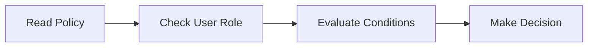
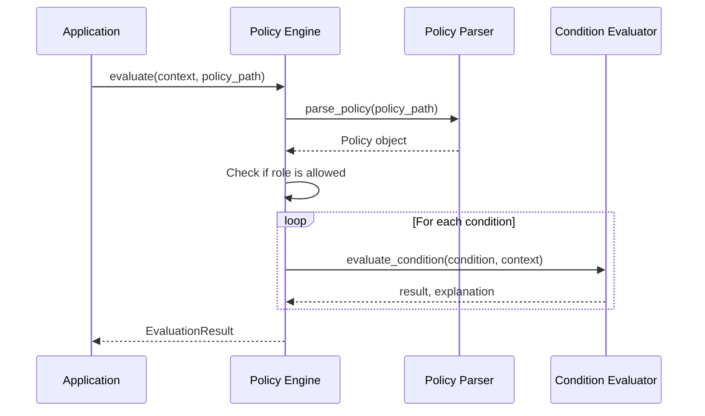

# Chapter 3: Policy Engine

In [Chapter 2: Policy Definition](02_policy_definition_.md), we learned how to create rulebooks (policies) that specify what data needs protection and who can access it. Now, let's explore the component that brings these rules to life: the **Policy Engine**.

## Introduction: The Security Guard for Your Data

Imagine you have a secure building with different rooms containing sensitive information. You've written rules about who can enter each room, but you still need a security guard to check IDs, verify permissions, and enforce those rules. In Marvis Vault, the Policy Engine is that security guard.

The Policy Engine takes your policy rules, looks at who's requesting access (and why), and makes decisions about whether to show or hide sensitive information. It's the critical component that turns your written policies into actual data protection.

## A Real-World Example

Let's continue with our healthcare example from the previous chapter. A doctor named Dr. Smith is trying to view a patient record that contains:

```json
{
  "patientName": "Jane Doe",
  "ssn": "123-45-6789",
  "diagnosis": "Common Cold",
  "contactNumber": "555-123-4567"
}
```

Our policy says that SSNs should be masked, but doctors can see them if they're treating the patient. When Dr. Smith tries to view this record, the Policy Engine needs to:

1. Check if Dr. Smith is a doctor (role check)
2. Check if Dr. Smith is treating this patient (condition check)
3. Decide whether to show or hide the SSN

This is exactly what the Policy Engine does!

## How the Policy Engine Works

The Policy Engine works in three simple steps:



Let's break down each step:

### 1. Read Policy

First, the Policy Engine reads and parses your policy file (the rulebook). It identifies:
- Which fields need protection (`mask`)
- Which roles might get access (`unmask_roles`)
- Under what conditions access should be granted (`conditions`)

### 2. Check User Role

Next, it checks if the user's role is in the `unmask_roles` list. If not, the decision is simple: deny access and mask the data.

### 3. Evaluate Conditions

If the role check passes, the Policy Engine evaluates each condition in the policy. These conditions might check things like:
- Is this an emergency?
- Is the doctor assigned to this patient?
- Has the patient given consent?

### 4. Make Decision

Based on the role check and condition evaluation, the Policy Engine makes a final decision:
- If all checks pass: Allow access to the sensitive data
- If any check fails: Mask the sensitive data

## Using the Policy Engine

Let's see how the Policy Engine is used in practice. While you don't usually interact with it directly (the CLI does that for you), understanding how it works helps you write better policies.

### Simple Evaluation Example

Here's how you might use the Policy Engine in your code:

```python
from vault.engine.policy_engine import evaluate

# Context contains information about the request
context = {
    "role": "doctor",
    "patient_id": "12345",
    "is_treating_physician": True
}

# Evaluate policy against this context
result = evaluate(context, "patient_policy.json")

if result.success:
    # Show unmasked data
    print("Access granted: User can see sensitive data")
else:
    # Show masked data
    print(f"Access denied: {result.reason}")
```

This code:
1. Creates a context with information about the user and situation
2. Calls the Policy Engine to evaluate the policy against this context
3. Takes action based on the result

### Understanding the Context

The "context" is a dictionary that contains all the information the Policy Engine needs to make a decision. It includes:

- `role`: Who is making the request (e.g., "doctor", "nurse")
- Other variables used in your conditions (e.g., `department`, `emergency`)

For example, if your policy contains the condition `role == 'doctor' && is_emergency == true`, your context should include both `role` and `is_emergency`.

### The Evaluation Result

When the Policy Engine evaluates a policy, it returns a result that tells you:

1. Whether access should be granted (`success`)
2. Why the decision was made (`reason`)
3. Which fields should be masked (`fields`)

```python
# Example result object
EvaluationResult(
    success=False,
    reason="Condition failed: is_treating_physician must be True",
    fields=["ssn", "contactNumber"]
)
```

## How Policy Engine Works Under the Hood

Let's look at what happens step-by-step when the Policy Engine evaluates a policy:



1. The application calls the Policy Engine with a context and policy path
2. The Policy Engine asks the Policy Parser to load and parse the policy
3. The engine checks if the user's role is in the allowed roles list
4. For each condition, the engine asks the Condition Evaluator to check if it's satisfied
5. The engine returns the final decision

### Code Behind the Engine

Let's look at the core code in `vault/engine/policy_engine.py`:

```python
def evaluate(context: Dict[str, Any], policy_path: str) -> EvaluationResult:
    # Parse policy
    policy = parse_policy(policy_path)
    
    # Check role
    if context.get("role") not in policy.unmask_roles:
        return EvaluationResult(
            success=False,
            reason=f"Role {context.get('role')} not allowed",
            fields=policy.mask
        )
    
    # Evaluate conditions
    for condition in policy.conditions:
        success, explanation = evaluate_condition(condition, context)
        if not success:
            return EvaluationResult(
                success=False,
                reason=f"Condition failed: {explanation}",
                fields=policy.mask
            )
            
    return EvaluationResult(
        success=True,
        reason="All conditions passed",
        fields=[]
    )
```

This function is the heart of the Policy Engine. It:
1. Parses the policy file
2. Checks if the user's role is allowed
3. Evaluates each condition, stopping if any fail
4. Returns the result with an explanation

The actual condition evaluation is handled by the [Condition Evaluator](04_condition_evaluator_.md), which we'll learn about in the next chapter.

## Practical Example: A Complete Flow

Let's follow a complete example of the Policy Engine in action:

1. **Start with a policy:**

```json
{
  "mask": ["ssn"],
  "unmask_roles": ["doctor"],
  "conditions": ["role == 'doctor' && is_treating_physician == true"]
}
```

2. **Create a context for evaluation:**

```python
context = {
    "role": "doctor",
    "is_treating_physician": False  # Doctor is not treating this patient
}
```

3. **Policy Engine evaluates the policy:**

```python
result = evaluate(context, "policy.json")
# Result: success=False, reason="Condition failed: is_treating_physician must be True"
```

4. **Application uses the result:**

```python
if result.success:
    # Show unmasked data (including SSN)
    show_full_data(patient_data)
else:
    # Show masked data (SSN is hidden)
    show_masked_data(patient_data, result.fields)
```

In this example, the Policy Engine correctly determines that, even though the user is a doctor, they shouldn't see the SSN because they're not the treating physician.

## Common Use Cases for the Policy Engine

The Policy Engine can handle many different scenarios:

### 1. Role-Based Access Control

The simplest use case is controlling access based on roles:

```json
{
  "mask": ["credit_card_number"],
  "unmask_roles": ["financial_analyst"],
  "conditions": ["role == 'financial_analyst'"]
}
```

This policy only allows financial analysts to see credit card numbers.

### 2. Time-Based Access

You can restrict access to certain times:

```json
{
  "mask": ["salary_data"],
  "unmask_roles": ["hr_manager"],
  "conditions": ["role == 'hr_manager' && time_of_day >= '9:00' && time_of_day <= '17:00'"]
}
```

This policy only allows HR managers to see salary data during business hours.

### 3. Purpose-Based Access

Access can be granted based on why someone needs the data:

```json
{
  "mask": ["medical_history"],
  "unmask_roles": ["doctor", "nurse"],
  "conditions": ["purpose == 'treatment' || purpose == 'emergency'"]
}
```

This policy allows medical staff to see medical history only for treatment or emergencies.

## Debugging Policy Evaluation

When your policy isn't working as expected, you can debug it using the `simulate` command we learned about in [Chapter 1: CLI Interface](01_cli_interface_.md):

```bash
vault simulate --policy my_policy.json --context context.json
```

This will show you exactly why a policy passed or failed, helping you fix any issues.

## Conclusion

The Policy Engine is the decision-maker in Marvis Vault that determines whether sensitive data should be masked or unmasked. It takes your policy definitions and evaluates them against contextual information to make data protection decisions.

In this chapter, we've learned:
- How the Policy Engine acts as a security guard for your data
- The step-by-step process of policy evaluation
- How to use the Policy Engine in practice
- How the engine works under the hood
- Common use cases and debugging techniques

Now that you understand how the Policy Engine makes decisions, let's dive deeper into how it evaluates specific conditions in the next chapter: [Condition Evaluator](04_condition_evaluator_.md).

---
