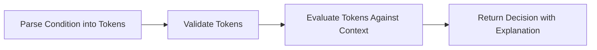
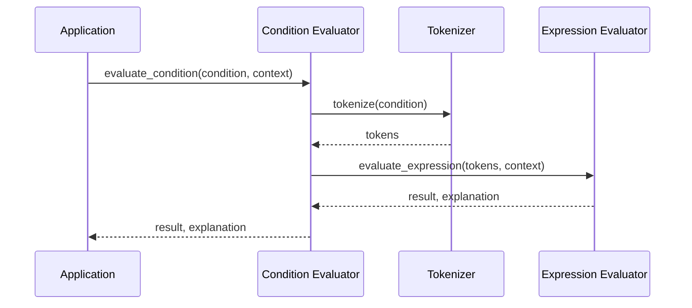

# Chapter 4: Condition Evaluator

In [Chapter 3: Policy Engine](03_policy_engine_.md), we learned how the Policy Engine acts as a security guard for your data, using policies to decide what information to reveal. But how does it understand and evaluate the conditions in your policies? That's where the **Condition Evaluator** comes in.

## Introduction: The Judge of Your Data Access Rules

Imagine you're a judge in a courtroom. Someone requests access to confidential information, and you need to decide if they should get it. You have a list of legal rules written in a specific language (like "role == 'admin' && trustScore > 80"). To make your decision, you need to:

1. Understand the language of these rules
2. Check if the facts of the case match the rules
3. Make a yes/no decision based on this evaluation

In Marvis Vault, the Condition Evaluator is this judge. It understands the language of conditions, evaluates them against the current facts (context), and determines whether access should be granted.

## A Real-World Example

Let's say we have a policy condition like this:

```
role == 'analyst' && department == 'finance' && trustScore > 75
```

This condition says: "Grant access if the user is an analyst in the finance department with a trust score above 75."

When someone requests access, the Condition Evaluator needs to:
1. Break down this complex condition into understandable parts
2. Check each part against the current context (who's asking, what department they're in, etc.)
3. Determine if all parts of the condition are satisfied

## Understanding Condition Syntax

Before we dive deeper, let's understand the language that conditions use:

### Basic Comparisons

```
field == value   # Is equal to
field != value   # Is not equal to
field > value    # Is greater than
field < value    # Is less than
```

### Logical Operators

```
condition1 && condition2   # AND - both must be true
condition1 || condition2   # OR - at least one must be true
```

### Example Conditions

```
role == 'admin'                     # Simple equality check
trustScore > 80                     # Numeric comparison
role == 'manager' && inOffice == true   # Combination with AND
department == 'HR' || department == 'Management'  # Combination with OR
```

## How the Condition Evaluator Works

The Condition Evaluator works in three main steps:



### 1. Parsing Conditions into Tokens

First, the evaluator breaks down the condition string into smaller pieces called "tokens." Each token represents a meaningful part of the condition:

For the condition `role == 'admin' && trustScore > 80`:

```
Tokens: [
    (VALUE, "role"), 
    (OPERATOR, EQUALS), 
    (LITERAL, "admin"), 
    (OPERATOR, AND), 
    (VALUE, "trustScore"), 
    (OPERATOR, GREATER_THAN), 
    (VALUE, 80)
]
```

### 2. Validating Tokens

Next, it checks that the tokens form a valid condition:
- Are all operators valid?
- Do all variables exist in our context?
- Are we comparing proper types (e.g., numbers with numbers)?

### 3. Evaluating Against Context

Finally, it evaluates the tokens against the actual context (the facts of the case):

```python
context = {
    "role": "admin",
    "trustScore": 85
}
```

With this context, the condition `role == 'admin' && trustScore > 80` would evaluate to `true` because:
- `role == 'admin'` is true (the role is "admin")
- `trustScore > 80` is true (the trust score is 85, which is greater than 80)
- Both conditions are connected with AND, and both are true

## Using the Condition Evaluator

Let's see how to use the Condition Evaluator in practice:

```python
from vault.engine.condition_evaluator import evaluate_condition

# Define the context (facts about the current situation)
context = {
    "role": "analyst",
    "department": "finance",
    "trustScore": 90
}

# Evaluate a condition
result, explanation = evaluate_condition(
    "role == 'analyst' && department == 'finance' && trustScore > 75",
    context
)

print(f"Access granted: {result}")
print(f"Reason: {explanation}")
```

This code:
1. Imports the `evaluate_condition` function
2. Creates a context with information about the user
3. Evaluates a condition against this context
4. Gets back a result (true/false) and an explanation

The output would be:
```
Access granted: True
Reason: (role == analyst is True) AND ((department == finance is True) AND (trustScore > 75 is True)) is True
```

## Understanding Common Condition Patterns

Let's look at some common patterns you'll use with the Condition Evaluator:

### Role-Based Conditions

```python
condition = "role == 'admin' || role == 'manager'"
context = {"role": "manager"}
result, _ = evaluate_condition(condition, context)  # True
```

This condition grants access to either admins or managers.

### Numeric Thresholds

```python
condition = "trustScore > 80"
context = {"trustScore": 75}
result, _ = evaluate_condition(condition, context)  # False
```

This condition only grants access if the trust score is above 80.

### Combining Multiple Factors

```python
condition = "role == 'analyst' && projectAccess == true"
context = {"role": "analyst", "projectAccess": False}
result, _ = evaluate_condition(condition, context)  # False
```

This condition requires both the right role AND project access.

## Inside the Condition Evaluator

Let's peek under the hood to understand how the Condition Evaluator works internally:



1. The application calls `evaluate_condition` with a condition string and context
2. The Condition Evaluator calls the tokenizer to break the condition into tokens
3. The tokenizer returns the list of tokens
4. The evaluator asks the expression evaluator to evaluate these tokens against the context
5. The expression evaluator returns the result and explanation
6. The Condition Evaluator returns this information to the application

### The Tokenization Process

The tokenizer turns your condition string into tokens by scanning it character by character:

```python
def _tokenize(condition: str) -> list[Token]:
    tokens = []
    i = 0
    
    while i < len(condition):
        char = condition[i]
        
        # Skip whitespace
        if char.isspace():
            i += 1
            continue
            
        # Handle operators (&&, ||, ==, etc.)
        if char in ['&', '|', '=', '!', '>', '<']:
            # Code to recognize operators
            # ...
```

This function reads each character and creates appropriate tokens for operators, values, and literals.

### The Evaluation Process

Once we have tokens, we evaluate them against the context:

```python
def _evaluate_expression(tokens, context):
    # Handle comparison (e.g., role == 'admin')
    if len(tokens) == 3 and tokens[1].type == TokenType.OPERATOR:
        left = tokens[0].value
        op = tokens[1].value
        right = tokens[2].value
        
        # Get values from context if needed
        if left in context:
            left = context[left]
        if right in context:
            right = context[right]
            
        # Compare and return result
        if op == Operator.EQUALS:
            result = (left == right)
            return result, f"{left} == {right} is {result}"
        # Handle other operators...
```

This function evaluates simple comparisons and complex logical expressions by checking each part of the condition.

## Real-World Examples in Action

Let's look at some practical examples of how the Condition Evaluator is used in real policies:

### Example 1: Healthcare Data Access

```json
{
  "mask": ["medical_history"],
  "unmask_roles": ["doctor", "nurse"],
  "conditions": ["role == 'doctor' || (role == 'nurse' && emergency == true)"]
}
```

This policy says:
- Doctors can always access medical history
- Nurses can only access it in emergencies

The Condition Evaluator parses and evaluates the complex condition `role == 'doctor' || (role == 'nurse' && emergency == true)` to make this decision.

### Example 2: Financial Data with Time Restrictions

```json
{
  "mask": ["account_balance"],
  "unmask_roles": ["teller", "manager"],
  "conditions": ["role == 'manager' || (role == 'teller' && working_hours == true)"]
}
```

This policy says:
- Managers can always access account balances
- Tellers can only access them during working hours

## Common Gotchas and How to Avoid Them

When working with the Condition Evaluator, watch out for these common mistakes:

### 1. Missing Context Variables

If your condition uses a variable that's not in the context, evaluation will fail:

```python
condition = "role == 'admin' && department == 'IT'"
context = {"role": "admin"}  # Missing department!
# This will raise an error
```

Always make sure all variables used in your conditions exist in the context.

### 2. Type Mismatches

The Condition Evaluator is strict about types:

```python
condition = "age > 18"
context = {"age": "twenty"}  # String instead of number!
# This will raise an error
```

Ensure variables used in numeric comparisons (`>`, `<`) are actually numbers.

### 3. Complex Nested Conditions

While the Condition Evaluator can handle nested conditions, overly complex ones can be hard to debug:

```
(role == 'admin' || role == 'manager') && (department == 'IT' || department == 'Security') && trustScore > 80
```

Consider breaking complex conditions into simpler ones for clarity.

## Conclusion

The Condition Evaluator is the judge that brings your policy conditions to life. It takes condition strings, parses them into understandable pieces, and evaluates them against the current context to make access decisions.

In this chapter, we've learned:
- How the Condition Evaluator acts as a judge for your policy conditions
- The syntax and structure of conditions
- How conditions are tokenized and evaluated
- Common patterns and potential pitfalls

Now that you understand how conditions are evaluated, let's move on to the next component: the [Redaction System](05_redaction_system_.md), which actually applies the masking to your sensitive data based on these condition evaluations.

---

