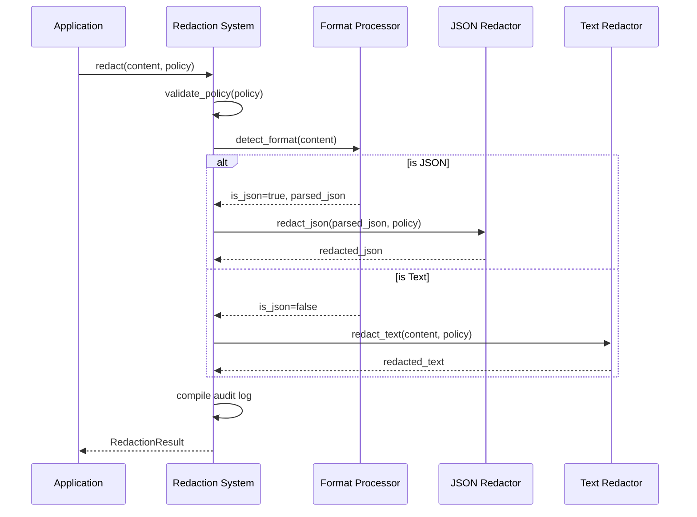

# Chapter 4: Redaction System

In [Chapter 3: Condition Evaluator](03_condition_evaluator_.md), we explored how conditions are evaluated to make access decisions. Now, we'll learn about what happens when access is denied - how do we actually hide sensitive information? This is where the **Redaction System** comes in!

## Introduction: What is a Redaction System?

Think of the Redaction System like a censor at a government agency who reviews classified documents before public release. Using a black marker, they hide sensitive information while keeping the rest of the document intact.

In marvis-vault-oss, the Redaction System performs this role automatically. When it encounters data that should be protected according to policy rules, it replaces sensitive values with a neutral placeholder: `[REDACTED]`.

## Why Do We Need a Redaction System?

Let's consider a practical example: a customer service application that handles support tickets with personal and payment information.

A typical support ticket might look like this:

```json
{
  "ticketId": "T-12345",
  "customer": {
    "name": "Alice Smith",
    "email": "alice@example.com",
    "creditCard": "4111-2222-3333-4444",
    "ssn": "123-45-6789"
  },
  "issue": "Payment failed",
  "priority": "High"
}
```

When different team members access this ticket, we need to ensure that sensitive fields like credit card numbers and social security numbers are only visible to authorized personnel. Instead of completely hiding the ticket, we can redact just the sensitive parts:

```json
{
  "ticketId": "T-12345",
  "customer": {
    "name": "Alice Smith",
    "email": "alice@example.com",
    "creditCard": "[REDACTED]",
    "ssn": "[REDACTED]"
  },
  "issue": "Payment failed",
  "priority": "High"
}
```

This way, most team members can still access and work with the ticket without seeing protected information.

## How the Redaction System Works

The Redaction System works with two key inputs:

1. **Content** - The data (JSON or text) that might contain sensitive information
2. **Policy** - The rules defining which fields should be redacted

It processes these inputs and produces redacted content, along with an audit log tracking what was redacted.

### Handling Different Content Types

The Redaction System can process two main types of content:

1. **Structured JSON** - When data has a clear hierarchical structure
2. **Unstructured Text** - When working with plain text, logs, or other text formats

Let's see how both are handled.

## Redacting JSON Data

Let's create a simple redaction policy for our support ticket example:

```json
{
  "mask": ["creditCard", "ssn"],
  "unmask_roles": ["financial-team"],
  "conditions": ["role == 'financial-team'"]
}
```

This policy tells the system to mask credit card numbers and social security numbers, and only unmask them for the financial team.

Here's how to use the Redaction System in code:

```python
from vault.sdk.redact import redact

# Our support ticket data
ticket_json = '{"ticketId": "T-12345", "customer": {"creditCard": "4111-2222-3333-4444"}}'

# Our redaction policy
policy = {
  "mask": ["creditCard", "ssn"],
  "unmask_roles": ["financial-team"],
  "conditions": ["role == 'financial-team'"]
}

# Apply redaction
result = redact(ticket_json, policy)

# Get the redacted content
print(result.content)
```

This produces:

```
{"ticketId": "T-12345", "customer": {"creditCard": "[REDACTED]"}}
```

The Redaction System automatically:
1. Detects that the input is JSON
2. Finds the sensitive `creditCard` field
3. Replaces its value with `[REDACTED]`

## Redacting Text Data

The Redaction System can also handle unstructured text. Imagine we have a log message:

```
User login successful for alice@example.com (creditCard: 4111-2222-3333-4444)
```

We can redact it using the same policy:

```python
from vault.sdk.redact import redact

# Our log message
log_text = "User login successful for alice@example.com (creditCard: 4111-2222-3333-4444)"

# Our redaction policy
policy = {
  "mask": ["creditCard", "ssn"],
  "unmask_roles": ["financial-team"],
  "conditions": ["role == 'financial-team'"]
}

# Apply redaction
result = redact(log_text, policy)

# Get the redacted content
print(result.content)
```

Which produces:

```
User login successful for alice@example.com (creditCard: [REDACTED])
```

## Understanding Field Matching

The Redaction System uses pattern matching to find fields in both JSON and text. For JSON, it matches field names directly. For text, it looks for patterns like `fieldName: value` or `fieldName=value`.

You can also use wildcards in your policy to match multiple fields:

```json
{
  "mask": ["credit*", "ssn"],
  "unmask_roles": ["financial-team"],
  "conditions": ["role == 'financial-team'"]
}
```

This would match fields like `creditCard`, `creditLimit`, `creditScore`, etc.

## Field Aliases

Sometimes the same sensitive information might appear with different field names. For example, a credit card might be labeled as `creditCard`, `cc`, or `payment_method`. 

You can handle this with field aliases:

```json
{
  "mask": ["creditCard", "ssn"],
  "unmask_roles": ["financial-team"],
  "conditions": ["role == 'financial-team'"],
  "field_aliases": {
    "creditCard": ["cc", "payment_method", "card_number"]
  }
}
```

Now the system will redact all these variations as if they were `creditCard`.

## Audit Logging

A key feature of the Redaction System is its detailed audit logging. Every time something is redacted, a record is created:

```python
# Print audit information
for entry in result.audit_log:
    print(f"Redacted field: {entry['field']}")
    print(f"Reason: {entry['reason']}")
    print(f"Original value: {entry['original_value']}")
```

This audit log helps you:
1. Track what was redacted and why
2. Debug issues with redaction policies
3. Monitor sensitive data handling

## Command Line Interface

The Redaction System can be used directly from the command line:

```bash
python -m vault.cli.redact --policy policy.json --input data.json --output redacted.json
```

This reads `data.json`, applies the redaction policy from `policy.json`, and writes the redacted output to `redacted.json`.

You can also generate an audit log:

```bash
python -m vault.cli.redact --policy policy.json --input data.json --audit audit.json
```

## Under the Hood: How Redaction Works

When you call the `redact()` function, here's what happens step by step:

1. **Validate the policy** - Check that the policy has the required fields
2. **Detect content format** - Is this JSON or plain text?
3. **Apply redaction** - Use the appropriate method based on content type
4. **Track changes** - Record what was redacted in the audit log
5. **Return the result** - Provide the redacted content and audit information

Let's visualize this process:



Let's look at simplified versions of the key functions:

### JSON Redaction

Here's how JSON redaction works:

```python
def redact_json(data, policy, result, path=""):
    if isinstance(data, dict):
        redacted = {}
        for key, value in data.items():
            # Check if key matches any mask pattern
            if key in policy["mask"]:
                redacted[key] = "[REDACTED]"
                result.add_audit_entry(key, "Field masked by policy", str(value))
            else:
                # Recursively process nested objects
                redacted[key] = redact_json(value, policy, result)
        return redacted
    # Handle lists and other types...
```

This function recursively processes the JSON structure, looking for field names that match entries in the `mask` list. When it finds a match, it replaces the value with `[REDACTED]`.

### Text Redaction

Text redaction uses regular expressions to find and replace sensitive information:

```python
def redact_text(text, policy, result):
    # Create regex patterns for each field to mask
    patterns = create_field_patterns(policy["mask"])
    
    # Process line by line
    lines = text.splitlines()
    redacted_lines = []
    
    for line_num, line in enumerate(lines, 1):
        redacted_line = line
        for field, pattern in patterns.items():
            # Find and replace sensitive information
            if pattern.search(line):
                redacted_line = pattern.sub(f"{field}: [REDACTED]", redacted_line)
                result.add_audit_entry(field, "Field masked in text", line_num=line_num)
        redacted_lines.append(redacted_line)
    
    return "\n".join(redacted_lines)
```

This function creates a regular expression pattern for each field in the `mask` list, then processes the text line by line, replacing matches with `[REDACTED]`.

## Practical Example: Redacting Medical Records

Let's put it all together with a complete example. Imagine we have a medical records system and need to redact patient information for billing staff:

```python
from vault.sdk.redact import redact

# Patient record in JSON format
patient_record = """
{
  "patientId": "P12345",
  "name": "John Doe",
  "age": 45,
  "diagnosis": "Hypertension",
  "ssn": "123-45-6789",
  "medications": ["Lisinopril", "Hydrochlorothiazide"],
  "billing": {
    "insuranceId": "INS-789",
    "paymentMethod": {
      "type": "creditCard",
      "number": "4111-2222-3333-4444",
      "expiry": "05/25"
    }
  }
}
"""

# Our redaction policy
policy = {
  "mask": ["diagnosis", "ssn", "medications", "creditCard"],
  "unmask_roles": ["doctor", "nurse"],
  "conditions": ["role == 'doctor' || role == 'nurse'"],
  "field_aliases": {
    "creditCard": ["number", "card", "cc"]
  }
}

# Apply redaction for a billing staff member
context = {"role": "billing"}
result = redact(patient_record, policy, context)

print(result.content)
```

For a billing staff member, the output would be:

```json
{
  "patientId": "P12345",
  "name": "John Doe",
  "age": 45,
  "diagnosis": "[REDACTED]",
  "ssn": "[REDACTED]",
  "medications": "[REDACTED]",
  "billing": {
    "insuranceId": "INS-789",
    "paymentMethod": {
      "type": "creditCard",
      "number": "[REDACTED]",
      "expiry": "05/25"
    }
  }
}
```

If we ran the same code with a doctor's role:

```python
# Apply redaction for a doctor
context = {"role": "doctor"}
result = redact(patient_record, policy, context)

print(result.content)
```

The output would show all the information, since doctors are allowed to see everything according to our policy.

## Best Practices for Using the Redaction System

1. **Be specific with field names**: Avoid overly general field names that might accidentally redact too much information.

2. **Use field aliases wisely**: Define aliases for common variations of sensitive field names.

3. **Always audit**: Enable audit logging in production to track what's being redacted and why.

4. **Test thoroughly**: Try your redaction policies on real data before deployment to ensure they catch all sensitive information.

5. **Don't overredact**: Only redact truly sensitive fields to avoid making the data unusable.

## Conclusion

The Redaction System is a powerful tool that protects sensitive information while keeping the rest of your data accessible. Unlike simple encryption that makes everything unreadable, redaction is selective - only hiding what needs to be hidden based on your policy rules.

In this chapter, we've learned:
- How the Redaction System identifies and masks sensitive information
- How to redact both JSON and text data
- How to use field aliases to catch variations of sensitive fields
- How the system keeps a detailed audit trail
- How to use the redaction system both programmatically and via the command line

While redaction protects sensitive data, there are legitimate cases where authorized users need to see the original information. In the next chapter, [Unmask Mechanism](05_unmask_mechanism_.md), we'll explore how to selectively reveal redacted information to authorized users under the right conditions.

---
