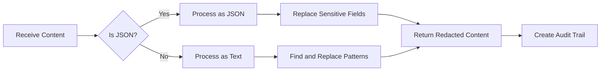
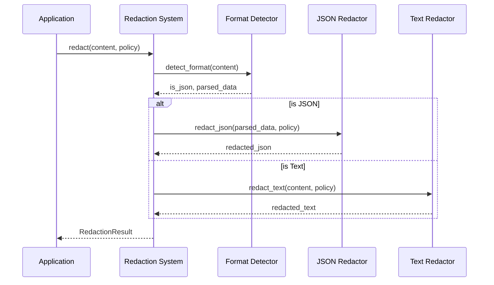

# Chapter 5: Redaction System

In [Chapter 4: Condition Evaluator](04_condition_evaluator_.md), we learned how Marvis Vault evaluates conditions to make access decisions. Now, let's explore what happens after those decisions are made: how sensitive information actually gets masked.

## Introduction: Your Personal Document Censor

Imagine you're preparing to share an important document with colleagues, but it contains sensitive information like credit card numbers or social security numbers that not everyone should see. You could manually go through the document with a black marker, covering each sensitive piece of information—but that would be time-consuming and error-prone.

The **Redaction System** is like an automated marker that intelligently identifies and blacks out sensitive information based on your policies. Just like a government official who redacts classified information from public documents, the Redaction System hides sensitive data with "[REDACTED]" markers.

## A Real-World Example

Let's say you're a healthcare administrator who needs to share patient information with different staff members. You have a document that looks like:

```json
{
  "patientName": "John Smith",
  "ssn": "123-45-6789",
  "diagnosis": "Common Cold",
  "billingInfo": {
    "cardNumber": "4111-1111-1111-1111",
    "expiryDate": "12/25"
  }
}
```

Clearly, not everyone needs to see the SSN and credit card information. The Redaction System can automatically mask these sensitive fields:

```json
{
  "patientName": "John Smith",
  "ssn": "[REDACTED]",
  "diagnosis": "Common Cold",
  "billingInfo": {
    "cardNumber": "[REDACTED]",
    "expiryDate": "12/25"
  }
}
```

This allows you to safely share the document without exposing sensitive information.

## How the Redaction System Works

The Redaction System can handle two types of content:

1. **Structured data** (like JSON): The system recognizes fields by their names
2. **Unstructured text**: The system scans for patterns that might indicate sensitive data

Let's break down the process:



## Using the Redaction System

Let's see how to use the Redaction System in practice:

### 1. Redacting JSON Data

```python
from vault.sdk.redact import redact

# Your sensitive data
data = '{"name": "Alice", "ssn": "123-45-6789"}'

# Your policy
policy = {
  "mask": ["ssn"],
  "unmask_roles": ["admin"],
  "conditions": ["role == 'user'"]
}

# Redact the data
result = redact(data, policy)

# Print the redacted content
print(result.content)
# Output: {"name": "Alice", "ssn": "[REDACTED]"}
```

This code takes your data and policy, then masks the fields listed in the policy's `mask` array.

### 2. Redacting Text Content

```python
# Plain text with sensitive information
text = "Patient: Bob Jones\nSSN: 987-65-4321\nDiagnosis: Flu"

# Apply the same redaction
result = redact(text, policy)

print(result.content)
# Output: "Patient: Bob Jones\nSSN: [REDACTED]\nDiagnosis: Flu"
```

The system is smart enough to recognize field patterns in plain text too!

### 3. Using the CLI for Redaction

You can also use the command line interface we learned about in [Chapter 1: CLI Interface](01_cli_interface_.md):

```bash
vault redact --input patient_data.json --policy privacy_policy.json --output safe_data.json
```

This command reads the input file, applies the redaction policy, and writes the safe version to the output file.

## Audit Trails: Tracking What Was Redacted

An important feature of the Redaction System is that it keeps track of everything it redacts. This creates an "audit trail" that can be used to:

1. Verify what information was hidden
2. Understand why it was hidden
3. Track who accessed the information

Let's look at a simple audit trail:

```json
{
  "field": "ssn",
  "reason": "Field masked by policy",
  "original_value": "123-45-6789",
  "line_number": 2,
  "timestamp": "2023-06-15T14:32:01Z"
}
```

This tells us that an SSN was redacted on line 2 of the document at a specific time.

## Inside the Redaction System

Let's see what happens when you call the redaction function:



1. The application calls `redact()` with content and a policy
2. The system detects whether the content is JSON or plain text
3. It chooses the appropriate redaction method based on content type
4. It returns a `RedactionResult` with the redacted content and audit trail

Let's look at some of the key implementation details:

### Format Detection

```python
def detect_format(content: str):
    """Detect if content is JSON and parse if possible."""
    try:
        parsed = json.loads(content)
        return True, parsed  # It's valid JSON
    except json.JSONDecodeError:
        return False, None   # It's not JSON
```

This function tries to parse the content as JSON. If successful, we treat it as structured data; otherwise, we handle it as text.

### JSON Redaction

The JSON redactor traverses the data structure and replaces sensitive fields:

```python
def redact_json(data, policy, result):
    """Recursively redact sensitive fields in JSON data."""
    if isinstance(data, dict):
        redacted = {}
        for key, value in data.items():
            # Check if key should be masked
            if key in policy["mask"]:
                redacted[key] = "[REDACTED]"
                # Record in audit trail
                result.add_audit_entry(key, "Field masked")
            else:
                # Process nested structures
                redacted[key] = redact_json(value, policy, result)
        return redacted
    # Handle lists and other types...
```

This function checks each key in a dictionary against the policy's `mask` list. If there's a match, it redacts the value and records the action.

### Text Redaction

For unstructured text, the system uses regular expressions to find patterns:

```python
def redact_text(text, policy, result):
    """Redact sensitive fields in plain text."""
    patterns = create_field_patterns(policy["mask"])
    lines = text.splitlines()
    redacted_lines = []
    
    for line_num, line in enumerate(lines, 1):
        redacted_line = line
        for field, pattern in patterns.items():
            # Find and replace sensitive patterns
            if pattern.search(line):
                redacted_line = pattern.sub(f"{field}: [REDACTED]", line)
                # Record in audit trail with line number
                result.add_audit_entry(field, "Text redacted", line_num)
        redacted_lines.append(redacted_line)
    
    return "\n".join(redacted_lines)
```

This function creates regular expression patterns for each field to be masked, then searches for those patterns in each line of text.

## Creating Custom Patterns for Redaction

Sometimes you need to redact information that doesn't follow standard field names. You can use regular expressions and field aliases for this:

```python
policy = {
    "mask": ["ssn", "credit_card"],
    "unmask_roles": ["admin"],
    "conditions": ["role == 'user'"],
    "fieldAliases": {
        "ssn": ["social", "social_security", "ss#"],
        "credit_card": ["cc", "card_number", "card#"]
    }
}
```

This policy will redact fields named `ssn` as well as any field named `social`, `social_security`, or `ss#`.

## Advanced Feature: Field-Specific Conditions

You can also apply different conditions to different fields:

```python
policy = {
    "mask": ["ssn", "diagnosis"],
    "unmask_roles": ["doctor", "nurse"],
    "conditions": ["role == 'doctor'"],
    "fieldConditions": {
        "diagnosis": "role == 'doctor' || role == 'nurse'"
    }
}
```

In this policy:
- SSNs are only visible to doctors
- Diagnoses are visible to both doctors and nurses

## Handling the Results

The `RedactionResult` object contains everything you need to know about what happened:

```python
# After redaction
print(f"Redacted fields: {result.redacted_fields}")
print(f"Total occurrences: {len(result.audit_log)}")

# Check if a specific field was redacted
if "ssn" in result.redacted_fields:
    print("SSN was redacted from the document")
```

This result object makes it easy to track what was redacted and understand the changes.

## Common Patterns and Gotchas

When working with the Redaction System, keep these tips in mind:

1. **Field Case Sensitivity**: By default, field matching is case-insensitive, so `"SSN"` and `"ssn"` are treated the same.

2. **Nested Fields**: For JSON data, the system handles nested fields automatically. For example, `"billingInfo.cardNumber"` will be redacted if `"cardNumber"` is in your mask list.

3. **Text Patterns**: Text redaction works best when fields follow patterns like `"fieldName: value"` or `"fieldName = value"`.

4. **Audit Trail Integrity**: Don't modify the audit trail directly; it's an important record of what happened.

## Conclusion

The Redaction System is the part of Marvis Vault that actually does the work of hiding sensitive information. It can process both structured JSON and unstructured text, maintaining a detailed audit trail of what was masked and why.

In this chapter, we've learned:
- How the Redaction System works like an automated censor
- How to redact sensitive information in JSON and text
- How audit trails track what was redacted
- How the system handles different content formats
- Advanced features like field aliases and field-specific conditions

Now that you understand how information is redacted, the next chapter will explore how authorized users can access that hidden information through the [Unmask Mechanism](06_unmask_mechanism_.md).

---
