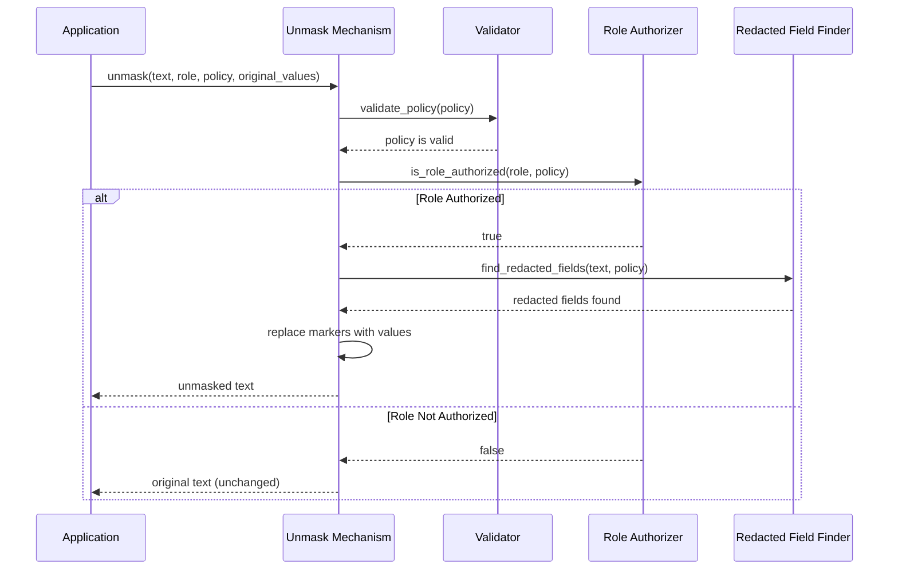

# Chapter 5: Unmask Mechanism

In [Chapter 4: Redaction System](04_redaction_system_.md), we learned how to hide sensitive information to protect it from unauthorized access. But what happens when an authorized user actually needs to see that protected data? This is where the **Unmask Mechanism** comes into play!

## Introduction

Think of the Unmask Mechanism like a security clearance system at a government agency. When you have the right clearance level and a legitimate need to know, you can request access to classified documents that would otherwise be redacted.

The Unmask Mechanism works in a similar way - it verifies that a user has the proper authorization before revealing previously redacted information. Let's explore this concept through a practical example.

## A Real-World Example: Hospital Information System

Imagine you're building a hospital information system. Patient records contain sensitive information like:

- Medical diagnosis
- Medications
- Social security number
- Insurance details

When a receptionist views a patient record, sensitive medical information is redacted. But when a doctor needs to review the same record, they should be able to see the complete information, including the previously redacted parts.

The Unmask Mechanism is what makes this possible!

## Key Concepts

Before diving into code, let's understand the core concepts of the Unmask Mechanism:

### 1. Redacted Content

This is the protected data where sensitive information has been replaced with placeholders (like `[REDACTED]`).

### 2. Original Values

These are the actual sensitive values that were hidden during redaction. They might be stored securely for later access.

### 3. Role-Based Authorization

Different user roles (like doctor, nurse, receptionist) have different levels of access to sensitive information.

### 4. Unmasking

The process of replacing `[REDACTED]` placeholders with the original values for authorized users.

## Using the Unmask Mechanism

Let's see how to use the Unmask Mechanism with a simple example:

```python
from vault.sdk.unmask import unmask

# Redacted patient record
redacted_data = """
  "patientId": "P12345",
  "name": "John Doe",
  "diagnosis": "[REDACTED]",
  "medications": "[REDACTED]"
"""

# Our policy
policy = {
  "mask": ["diagnosis", "medications"],
  "unmaskRoles": ["doctor", "nurse"],
  "conditions": ["role == 'doctor' || role == 'nurse'"]
}
```

This code defines a redacted patient record and a policy specifying which roles can unmask the redacted information.

Now let's try to unmask this data for different roles:

```python
# Try unmasking for a doctor
doctor_view = unmask(redacted_data, "doctor", policy)
print("Doctor view:", doctor_view)

# Try unmasking for a receptionist
receptionist_view = unmask(redacted_data, "receptionist", policy)
print("Receptionist view:", receptionist_view)
```

For the doctor, the output would show unmasked information:
```
Doctor view:
  "patientId": "P12345",
  "name": "John Doe",
  "diagnosis:",
  "medications:"
```

For the receptionist, the output would remain redacted:
```
Receptionist view:
  "patientId": "P12345",
  "name": "John Doe",
  "diagnosis": "[REDACTED]",
  "medications": "[REDACTED]"
```

Notice that for the doctor, `[REDACTED]` has been removed, but there's still no actual value. This is because we haven't provided the original values. Let's fix that:

```python
# Original values
original_values = {
  "diagnosis": "Hypertension",
  "medications": "Lisinopril, Hydrochlorothiazide"
}

# Unmask with original values
doctor_view = unmask(redacted_data, "doctor", policy, original_values)
print("Doctor view with values:", doctor_view)
```

Now the doctor will see:
```
Doctor view with values:
  "patientId": "P12345",
  "name": "John Doe",
  "diagnosis: Hypertension",
  "medications: Lisinopril, Hydrochlorothiazide"
```

## Storing and Retrieving Original Values

But where do we get these original values from? Typically, they're stored securely when redaction happens:

```python
from vault.sdk.redact import redact
from vault.sdk.unmask import unmask

# Original patient data
patient_data = """
  "patientId": "P12345",
  "name": "John Doe", 
  "diagnosis": "Hypertension",
  "medications": "Lisinopril, Hydrochlorothiazide"
"""

# Redact the data and collect original values
result = redact(patient_data, policy)
redacted_data = result.content
original_values = result.get_original_values()
```

This shows how the original values are collected during redaction and can be stored for later use with unmasking.

## How the Unmask Mechanism Works Internally

When you call the `unmask()` function, several steps happen behind the scenes:

1. **Validate the policy**: Check that the policy has all required fields
2. **Check role authorization**: Verify the user's role is allowed to unmask
3. **Find redacted fields**: Locate the `[REDACTED]` markers in the text
4. **Replace markers**: If authorized, replace markers with original values

Let's visualize this process:



## The Code Behind Unmasking

Let's examine the simplified code that powers the Unmask Mechanism:

```python
def unmask(text, role, policy, original_values=None):
    # Validate policy
    if not validate_policy(policy):
        return text  # Return unchanged if policy is invalid
    
    # Check role authorization
    if role not in policy["unmaskRoles"]:
        return text  # Return unchanged if role not authorized
```

This first part validates the policy and checks if the role is authorized. If either check fails, the text is returned unchanged.

Next, we need to find and replace the redacted fields:

```python
    # Create patterns for each field to unmask
    patterns = {}
    for field in policy["mask"]:
        pattern = re.compile(f"{field}\\s*:\\s*\\[REDACTED\\]")
        patterns[field] = pattern
    
    # Replace [REDACTED] with original values when available
    result = text
    for field, pattern in patterns.items():
        if original_values and field in original_values:
            value = original_values[field]
            replacement = f"{field}: {value}"
        else:
            replacement = f"{field}:"
        
        result = pattern.sub(replacement, result)
    
    return result
```

This part creates regular expression patterns to find the redacted fields and replaces them with original values when available.

## Advanced Unmasking with Conditions

The Unmask Mechanism integrates with the [Condition Evaluator](03_condition_evaluator_.md) to support more complex authorization rules:

```python
from vault.engine.condition_evaluator import evaluate_condition

def unmask_with_conditions(text, context, policy, original_values=None):
    # Check role first
    if context.get("role") not in policy["unmaskRoles"]:
        return text
    
    # Evaluate all conditions
    for condition in policy["conditions"]:
        result, _ = evaluate_condition(condition, context)
        if not result:
            return text  # Fail if any condition is not met
```

This allows for more sophisticated access control based on various contextual factors beyond just the user's role.

## Integration with the Audit System

In production systems, unmasking sensitive data should be logged for security and compliance. The Unmask Mechanism integrates with the [Audit System](06_audit_system_.md):

```python
from vault.audit.logger import log_unmask_event

def unmask_with_audit(text, role, policy, original_values=None):
    result = unmask(text, role, policy, original_values)
    
    # If unmasking was performed, log it
    if result != text:
        log_unmask_event(
            role=role,
            fields=policy["mask"],
            timestamp=datetime.now()
        )
    
    return result
```

This ensures that every unmasking operation is properly recorded for future review.

## Best Practices for Using the Unmask Mechanism

1. **Principle of least privilege**: Only grant unmasking privileges to roles that truly need them.

2. **Always audit unmasking events**: Keep track of who accessed sensitive information and when.

3. **Secure original values**: Store original values securely, ideally encrypted at rest.

4. **Use specific conditions**: Don't just rely on roles; use conditions to enforce context-specific access rules.

5. **Inform users**: Let users know when they're viewing unmasked sensitive data to promote responsible handling.

## Practical Example: Patient Data Viewer

Let's put it all together with a practical example of a patient data viewer:

```python
def view_patient_record(patient_id, user):
    # Get redacted record and original values from secure storage
    redacted_record = storage.get_redacted_record(patient_id)
    original_values = secure_storage.get_original_values(patient_id)
    
    # Get policy for patient records
    policy = policy_store.get_policy("patient_records")
    
    # Create context for condition evaluation
    context = {
        "role": user.role,
        "department": user.department,
        "isPatientDoctor": user.id == patient.doctor_id
    }
```

In this example, we're retrieving a redacted patient record along with original values and the appropriate policy. We then create a context with information about the current user for condition evaluation.

Now we can apply the Unmask Mechanism:

```python
    # Attempt to unmask
    unmasked_record = unmask_with_conditions(
        redacted_record, 
        context, 
        policy, 
        original_values
    )
    
    # Log the access attempt
    log_record_access(
        user=user,
        patient_id=patient_id,
        was_unmasked=(unmasked_record != redacted_record)
    )
    
    return unmasked_record
```

This function completes the process by attempting to unmask the record based on the user's context, logging the access, and returning the result.

## Conclusion

The Unmask Mechanism is a crucial component that balances security with accessibility. It allows authorized users to access sensitive information when needed while maintaining protection against unauthorized access.

In this chapter, we explored:
- How the Unmask Mechanism provides controlled access to redacted information
- The key concepts of redacted content, original values, and role-based authorization
- How to use the unmask function with different user roles
- How unmasking works behind the scenes
- Best practices for implementing unmasking in your applications

With the Unmask Mechanism, our data protection system is now more flexible, allowing selective disclosure of sensitive information to authorized personnel.

In the next chapter, [Audit System](06_audit_system_.md), we'll explore how to track and log all these masking and unmasking operations for security, compliance, and debugging purposes.

---

