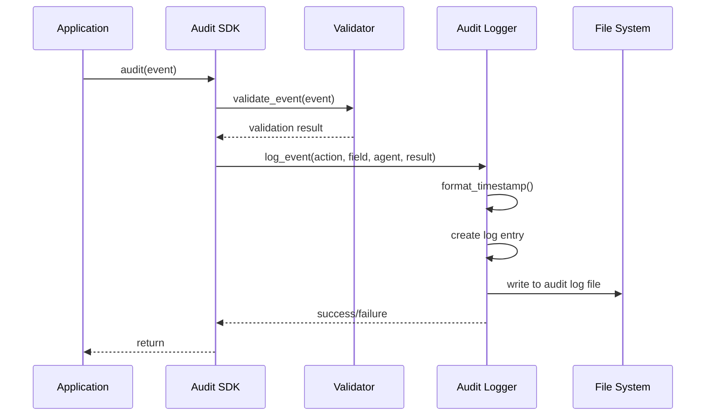

# Chapter 6: Audit System

In [Chapter 5: Unmask Mechanism](05_unmask_mechanism_.md), we learned how authorized users can reveal protected data. But how do we keep track of who accessed what sensitive information and when? This is where the **Audit System** comes in!

## Introduction: What is an Audit System?

Think of the Audit System like a security camera in a bank vault. The camera doesn't stop people from entering the vault, but it records everyone who does, what they touched, and when they were there. If something goes missing, the recordings can help identify what happened.

Similarly, our Audit System creates detailed records of how sensitive data is handled:
- Who accessed sensitive information
- Which fields were masked or unmasked
- When these actions occurred
- Why access was granted or denied

These audit logs are invaluable for security monitoring, compliance reporting, and identifying potential misuse patterns.

## Real-World Example: Healthcare Records

Imagine a hospital system where different staff members access patient records. Federal regulations (like HIPAA) require tracking who accesses sensitive health information. Let's say:

- Dr. Smith views Alice's medical diagnosis
- Nurse Johnson checks Alice's medication list
- A billing clerk accesses Alice's insurance information

The Audit System would record each of these actions, creating an audit trail that can be reviewed to ensure proper data handling.

## Key Components of the Audit System

The Audit System consists of three main components:

1. **Audit Logger**: Records individual events when sensitive data is accessed
2. **Audit Storage**: Securely stores these event records
3. **Trust Report Generator**: Analyzes patterns in the audit logs to identify potential issues

Let's explore each of these components.

## Using the Audit Logger

The Audit Logger is the most frequently used component. It's used whenever sensitive data is masked or unmasked. Here's a simple example:

```python
from vault.sdk.audit import audit

# Log an unmasking event
audit({
    "action": "unmask",
    "field": "diagnosis",
    "agent": {"role": "doctor", "trustScore": 95},
    "result": "unmasked"
})
```

This code logs that a doctor (with a high trust score) unmasked a patient's diagnosis. The audit entry includes:
- The action performed (unmasking)
- The field affected (diagnosis)
- Who performed it (a doctor with a trust score of 95)
- The result (successfully unmasked)

## Integrating with the Redaction System

The Audit System works closely with the [Redaction System](04_redaction_system_.md). Let's see how we can add auditing to our redaction code:

```python
from vault.sdk.redact import redact
from vault.sdk.audit import audit

def redact_with_audit(data, policy, user):
    # Perform redaction
    result = redact(data, policy)
    
    # Log each redacted field
    for field in result.redacted_fields:
        audit({
            "action": "redact",
            "field": field,
            "agent": {"role": user.role, "trustScore": user.trust_score},
            "result": "masked"
        })
    
    return result.content
```

This function performs redaction and logs each field that was masked, noting who requested the operation.

## Viewing Audit Logs

The Audit System includes a convenient CLI tool for viewing and analyzing logs:

```bash
python -m vault.cli.audit --log logs/audit_log.jsonl
```

This displays a summary of the audit log, showing:
- Total number of entries
- Unique roles that have accessed data
- Most frequently accessed fields
- Time range of access events

For a more detailed view, you can add the `--all` flag:

```bash
python -m vault.cli.audit --log logs/audit_log.jsonl --all
```

## Generating Trust Reports

Trust reports help identify unusual access patterns that might indicate misuse. Here's how to generate a basic trust report:

```python
from vault.audit.trust_report import generate_trust_report

# Generate a report from audit logs
report = generate_trust_report("logs/audit_log.jsonl")

# Review key metrics
print(f"Most accessed fields: {report['most_accessed_fields']}")
print(f"Most active roles: {report['most_frequent_roles']}")
```

This code analyzes the audit log to find patterns such as:
- Which sensitive fields are accessed most often
- Which user roles are most active
- The ratio of masking to unmasking operations

## How the Audit System Works Internally

When you call the audit function, several steps happen behind the scenes:

1. The event is validated to ensure it contains all required information
2. The event is formatted with a timestamp
3. The event is written to the audit log file
4. If any errors occur, warnings are raised

Let's visualize this process:



Let's look at how the audit validation works:

```python
def validate_event(event):
    # Check required fields exist
    required_fields = ["action", "field", "agent", "result"]
    if not all(field in event for field in required_fields):
        return False
    
    # Check agent has role and trustScore
    if not all(key in event["agent"] for key in ["role", "trustScore"]):
        return False
    
    return True
```

This validation ensures that every audit event contains the minimum required information.

## The Audit Log Format

Audit logs are stored in JSONL format (one JSON object per line), making them easy to process. Each entry looks like:

```json
{
  "timestamp": "2023-07-15T14:32:45Z",
  "action": "unmask",
  "field": "diagnosis",
  "agent": {
    "role": "doctor",
    "trustScore": 95
  },
  "result": "unmasked"
}
```

This format makes it easy to:
- Filter logs by field, action, or role
- Sort logs by timestamp
- Process logs with standard text tools

## Analyzing Audit Logs

The Trust Report Generator analyzes audit logs to identify patterns. Here's a simplified version of how it counts field access:

```python
def count_field_access(entries):
    # Initialize counter
    field_counts = {}
    
    # Count occurrences of each field
    for entry in entries:
        field = entry["field"]
        field_counts[field] = field_counts.get(field, 0) + 1
    
    # Sort by count (descending)
    return dict(sorted(
        field_counts.items(),
        key=lambda x: x[1],
        reverse=True
    ))
```

This function helps identify which sensitive fields are accessed most frequently, which might indicate areas needing additional protection.

## Identifying Suspicious Patterns

One of the most valuable features of the Audit System is detecting unusual access patterns:

```python
def get_role_field_patterns(entries):
    patterns = {}
    
    # Build role → field access map
    for entry in entries:
        role = entry["agent"]["role"]
        field = entry["field"]
        
        if role not in patterns:
            patterns[role] = {}
            
        patterns[role][field] = patterns[role].get(field, 0) + 1
    
    return patterns
```

This analysis can reveal when users access fields that are unusual for their role, which might indicate account compromise or insider threats.

## Practical Example: HIPAA Compliance Reporting

Let's put it all together with a practical example. Imagine we need to generate a HIPAA compliance report showing all accesses to patient data:

```python
from vault.cli.audit import read_audit_log
from pathlib import Path
import datetime

def generate_hipaa_report(start_date, end_date, output_path):
    # Read the audit log
    entries = read_audit_log(Path("logs/audit_log.jsonl"))
    
    # Filter entries by date and sensitive fields
    hipaa_fields = ["diagnosis", "medications", "treatment"]
    hipaa_entries = []
    
    for entry in entries:
        # Convert timestamp to datetime
        timestamp = datetime.fromisoformat(entry["timestamp"].replace("Z", "+00:00"))
        
        # Check if in date range and is a HIPAA field
        if (start_date <= timestamp <= end_date and 
            entry["field"] in hipaa_fields):
            hipaa_entries.append(entry)
    
    # Export to CSV for compliance review
    export_csv(hipaa_entries, output_path)
```

This function generates a compliance report by:
1. Reading the full audit log
2. Filtering for events related to sensitive health information
3. Narrowing to a specific date range
4. Exporting the filtered records to a CSV file for review

## Best Practices for Using the Audit System

1. **Audit All Sensitive Operations**: Always log access to sensitive data, whether successful or not

2. **Include Contextual Details**: Add relevant context like user roles, reasons for access, and trust scores

3. **Regular Review**: Schedule periodic reviews of audit logs to identify unusual patterns

4. **Retention Policy**: Define how long audit logs should be kept based on compliance requirements

5. **Secure Your Audit Logs**: Protect audit logs themselves as they contain sensitive information about your data access patterns

## Conclusion

The Audit System provides visibility and accountability for how sensitive data is handled in your application. It works hand-in-hand with the [Policy Engine](02_policy_engine_.md), [Redaction System](04_redaction_system_.md), and [Unmask Mechanism](05_unmask_mechanism_.md) to create a complete data protection solution.

In this chapter, we learned:
- How the Audit System records data access events
- How to integrate auditing with masking and unmasking operations
- How to analyze audit logs to identify potential misuse
- Best practices for implementing thorough auditing

With the Audit System in place, our data protection solution is not only secure but also transparent and accountable. Users can access the data they need while organizations maintain visibility into how sensitive information is being handled.

In the next chapter, [CLI Interface](07_cli_interface_.md), we'll learn how to interact with all these components through a convenient command-line interface.

---
