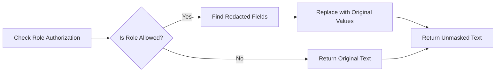
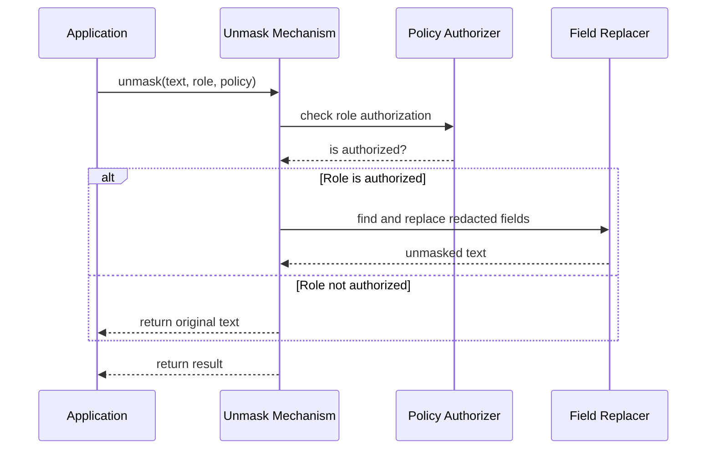

# Chapter 6: Unmask Mechanism

In [Chapter 5: Redaction System](05_redaction_system_.md), we learned how Marvis Vault hides sensitive information. But what happens when an authorized user actually needs to see that hidden data? That's where the **Unmask Mechanism** comes in.

## Introduction: The Declassification Officer

Imagine you work with classified documents where important information is blacked out. When an authorized official with proper clearance needs to see the original information, they talk to a "declassification officer" who verifies their identity, checks their clearance level, and then reveals the hidden content.

The Unmask Mechanism is exactly like that declassification officer. It gives authorized users the ability to see previously redacted information when they have the proper permissions.

## A Real-World Example

Let's say we have a patient record that has been redacted for privacy:

```json
{
  "patientName": "John Smith",
  "ssn": "[REDACTED]",
  "diagnosis": "Common Cold",
  "contactNumber": "[REDACTED]"
}
```

Dr. Johnson needs to contact this patient about test results and requires access to the hidden contact number. With the Unmask Mechanism:

1. Dr. Johnson provides her role ("doctor")
2. The system checks if doctors are allowed to see contact numbers
3. If allowed, the system reveals: `"contactNumber": "555-123-4567"`

## How Unmasking Works

The Unmask Mechanism works in three simple steps:



1. **Check Role Authorization**: Verify if the user's role has permission to unmask
2. **Find Redacted Fields**: Locate all `[REDACTED]` markers in the text
3. **Replace with Original Values**: Substitute the markers with the actual data

## Using the Unmask Mechanism

Let's see how to use the Unmask Mechanism in practice:

### Basic Unmasking

```python
from vault.sdk.unmask import unmask

# Redacted text from earlier
redacted_text = '{"name": "Alice", "ssn": "[REDACTED]"}'

# Policy defining who can unmask
policy = {
  "mask": ["ssn"],
  "unmaskRoles": ["admin", "doctor"],
  "conditions": ["role == 'admin' || role == 'doctor'"]
}

# Try to unmask as an admin
unmasked = unmask(redacted_text, "admin", policy)
print(unmasked)
```

This code takes redacted text, checks if the role "admin" is allowed to unmask, and then reveals the hidden SSN if possible.

### Unmasking with Original Values

Often you'll want to restore the exact original values:

```python
# Original values dictionary
originals = {
  "ssn": "123-45-6789"
}

# Unmask with original values
unmasked = unmask(redacted_text, "admin", policy, originals)
print(unmasked)  # {"name": "Alice", "ssn": "123-45-6789"}
```

This version restores the original SSN value rather than just removing the `[REDACTED]` marker.

### Using the CLI for Unmasking

You can also use the CLI to unmask files:

```bash
vault unmask --input redacted_file.json --role admin --policy policy.json --output unmasked_file.json
```

This command reads the redacted file, applies unmasking based on the role and policy, and writes the unmasked version to a new file.

## How Role Authorization Works

The first step in unmasking is checking if the user's role has permission:

```python
def is_role_authorized(role: str, policy: Dict[str, Any]) -> bool:
    """Check if the role is authorized to unmask fields."""
    return role in policy["unmaskRoles"]
```

This simple function checks if the user's role is in the list of roles allowed to unmask. If not, the unmasking process stops immediately.

## Finding and Replacing Redacted Fields

Once the role is authorized, the system finds redacted fields and replaces them:

```python
def create_unmask_patterns(fields: list) -> Dict[str, re.Pattern]:
    """Create patterns to match redacted fields."""
    patterns = {}
    for field in fields:
        pattern = rf"{field}\s*:\s*\[REDACTED\]"
        patterns[field] = re.compile(pattern, re.IGNORECASE)
    return patterns
```

This function creates regular expression patterns to find fields with `[REDACTED]` markers, making it easy to locate and replace them.

## Inside the Unmask Mechanism

Let's see what happens step-by-step when you call the unmask function:



1. The application calls `unmask()` with redacted text, a role, and a policy
2. The system checks if the role is authorized to unmask
3. If authorized, it finds and replaces redacted fields
4. It returns either the unmasked text or the original text

Now, let's look at the main implementation in `vault/sdk/unmask.py`:

```python
def unmask(text: str, role: str, policy: Dict[str, Any], 
          original_values: Optional[Dict[str, str]] = None) -> str:
    # Validate policy
    if not validate_policy(policy):
        warnings.warn("Invalid policy provided")
        return text
    
    # Check role authorization
    if not is_role_authorized(role, policy):
        return text
    
    # If no [REDACTED] markers, return as-is
    if "[REDACTED]" not in text:
        return text
    
    # Create patterns and replace redacted fields
    patterns = create_unmask_patterns(policy["mask"])
    # Rest of function...
```

This function follows the steps we discussed:
1. Validate the policy
2. Check role authorization
3. Look for redacted markers
4. Replace them with original values when possible

## Common Patterns for Unmasking

Here are some typical ways to use the Unmask Mechanism:

### Progressive Disclosure

Sometimes you want to reveal information gradually based on increasing levels of authorization:

```python
# First level - basic unmasking
basic_result = unmask(redacted_text, "nurse", policy)

# Second level - more sensitive information
if needs_more_info:
    full_result = unmask(redacted_text, "doctor", policy)
```

This approach reveals different levels of information based on different roles.

### Temporary Unmasking

For security, you might want to unmask only temporarily:

```python
# Unmask for specific use
unmasked = unmask(redacted_text, "admin", policy)
use_sensitive_data(unmasked)

# Clear from memory when done
del unmasked
```

This ensures sensitive information isn't kept in memory longer than necessary.

## Original Value Management

A key challenge with unmasking is managing the original values. There are several approaches:

1. **In-Memory Storage**: Keep originals in memory (least secure)
2. **Encrypted Storage**: Store originals encrypted on disk
3. **Secure API**: Fetch originals from a secure service when needed (most secure)

For example, with encrypted storage:

```python
# Get encrypted originals
encrypted_values = load_encrypted_values("patient_123.enc")

# Decrypt with proper authorization
if is_authorized(user_role):
    original_values = decrypt_values(encrypted_values, key)
    unmasked = unmask(redacted_text, user_role, policy, original_values)
```

This approach adds another layer of security to the unmasking process.

## Integration with the [Policy Engine](03_policy_engine_.md)

The Unmask Mechanism works closely with the [Policy Engine](03_policy_engine_.md) we learned about earlier:

```python
# Check complex conditions using the Policy Engine
from vault.engine.policy_engine import evaluate

context = {"role": user_role, "purpose": purpose, "time": current_time}
result = evaluate(context, policy_path)

if result.success:
    # Unmask only if policy conditions are met
    unmasked = unmask(redacted_text, user_role, policy, original_values)
```

This integration ensures that unmasking follows all the complex conditions defined in your policies.

## Conclusion

The Unmask Mechanism is the counterpart to the [Redaction System](05_redaction_system_.md), allowing authorized users to access sensitive information when needed. It checks role permissions, finds redacted fields, and restores original values based on your policy rules.

In this chapter, we've learned:
- How the Unmask Mechanism acts like a declassification officer
- How to use the mechanism to reveal redacted information
- How role authorization works to ensure security
- How the system finds and replaces redacted fields
- Different patterns for managing original values securely

Now that you understand how information can be both redacted and revealed, let's move on to see how all these actions are tracked in the next chapter: [Audit System](07_audit_system_.md).

---
