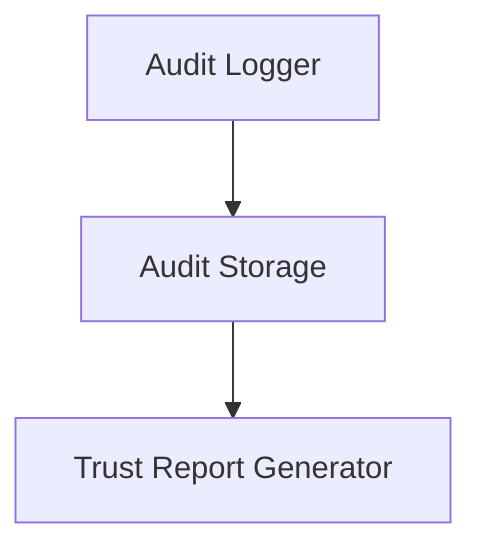
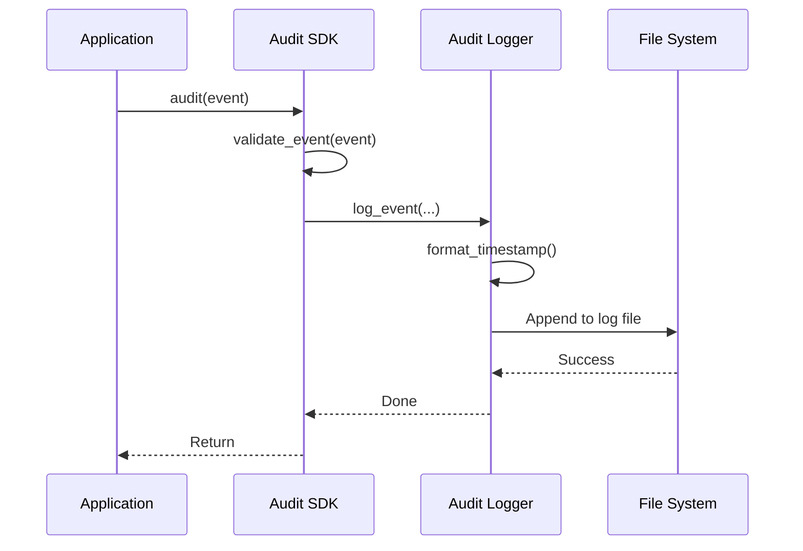

# Chapter 7: Audit System

In [Chapter 6: Unmask Mechanism](06_unmask_mechanism_.md), we learned how authorized users can access hidden information. But how do we keep track of who accessed what data, and why? This is where the **Audit System** comes in.

## Introduction: Your Data Access Ledger

Think about your bank account. Whenever money goes in or out, the bank keeps a detailed record: who made the transaction, when it happened, how much, and for what purpose. This creates an audit trail that helps identify suspicious activities and ensures accountability.

The Audit System in Marvis Vault works the same way for your sensitive data. It maintains a detailed record of every interaction with protected information: who accessed it, which fields they saw, when it happened, and why they needed access.

## A Real-World Example

Let's imagine you work at a healthcare company where patient records are protected. Dr. Sarah needs to access patient John Doe's social security number to verify his insurance. When she does this:

1. The redaction system masks the SSN field as "[REDACTED]"
2. Dr. Sarah requests to unmask the SSN for verification purposes
3. The unmask mechanism verifies she's allowed to do this
4. **The audit system records all of these events**

Later, if someone asks "Who accessed John Doe's SSN last month?", you can check the audit logs to see it was Dr. Sarah, when it happened, and why.

## Key Components of the Audit System

The Audit System has three main parts:



1. **Audit Logger**: Records details about each data access event
2. **Audit Storage**: Saves these records in a secure, tamper-resistant way
3. **Trust Report Generator**: Creates summaries and analysis from the logs

Let's explore each of these in detail.

## Recording Audit Events

The simplest way to record an audit event is using the SDK:

```python
from vault.sdk.audit import audit

# Create an audit event
event = {
    "action": "unmask",
    "field": "ssn",
    "agent": {"role": "doctor", "trustScore": 85},
    "result": "unmasked"
}

# Log the event
audit(event)
```

This code creates and logs an audit event when a doctor unmasks an SSN field. The `audit()` function validates the event and then saves it to the audit log.

## What Goes Into an Audit Event?

Every audit event includes:

1. **Action**: What was done (redact, unmask, simulate)
2. **Field**: Which data field was affected (ssn, creditCard, address)
3. **Agent**: Who performed the action (role and trust score)
4. **Result**: What happened (masked, unmasked, denied)
5. **Timestamp**: When it happened (added automatically)

This comprehensive information ensures you know exactly what happened to your sensitive data.

## Viewing Audit Logs

The Marvis Vault CLI makes it easy to review your audit logs:

```bash
vault audit --log logs/audit_log.jsonl
```

This command reads the audit log file and shows a summary of activities, including:

- Total number of events
- Unique roles that accessed data
- Most frequently accessed fields
- Time range of the events

For more detailed information, you can use the `--all` flag:

```bash
vault audit --log logs/audit_log.jsonl --all
```

This shows every individual audit event with all details.

## Filtering Audit Logs

Often you'll want to focus on specific roles or activities. You can filter logs by role:

```bash
vault audit --log logs/audit_log.jsonl --role doctor
```

This shows only the audit events where doctors accessed data.

## Exporting Audit Data

For compliance reporting or further analysis, you can export audit data to CSV or JSON:

```bash
vault audit --log logs/audit_log.jsonl --export report.csv
```

This creates a CSV file with all audit events, which you can open in Excel or other tools for analysis.

## Creating Trust Reports

Trust reports are powerful summaries that help identify patterns and potential issues:

```python
from vault.audit.trust_report import generate_trust_report

# Generate a report from audit logs
report = generate_trust_report("logs/audit_log.jsonl")

# See the most accessed fields
print(f"Most accessed fields: {report['most_accessed_fields']}")

# Check which roles are most active
print(f"Most active roles: {report['most_frequent_roles']}")
```

This code generates a trust report that shows which fields are accessed most frequently and which roles are most active, helping you identify unusual patterns.

## Inside the Audit System

Let's see what happens when an audit event is recorded:



1. Your application calls the `audit()` function with an event
2. The Audit SDK validates the event structure
3. The validated event is passed to the Audit Logger
4. The logger adds a timestamp and formats the event
5. The event is appended to the log file

Let's look at how the audit logger works in `vault/audit/audit_logger.py`:

```python
def log_event(action: str, field: str, agent: Dict[str, Any], result: str) -> None:
    # Validate agent
    validate_agent(agent)
    
    # Create log entry
    log_entry = {
        "timestamp": format_timestamp(),
        "action": action,
        "field": field,
        "agent": agent,
        "result": result
    }
    
    # Get log path
    log_path = get_log_path()
    
    # Append log entry
    with log_path.open("a") as f:
        json.dump(log_entry, f)
        f.write("\n")
```

This function validates the agent information, creates a log entry with a timestamp, and appends it to the log file. Each log entry is a JSON object on a separate line, making it easy to process later.

## Trust Report Implementation

The trust report analyzes patterns in the audit logs:

```python
def count_field_access(entries: List[Dict[str, Any]]) -> Dict[str, int]:
    """Count field access frequency."""
    fields = [entry["field"] for entry in entries]
    return dict(Counter(fields).most_common())

def count_role_frequency(entries: List[Dict[str, Any]]) -> Dict[str, int]:
    """Count role frequency."""
    roles = [entry["agent"]["role"] for entry in entries]
    return dict(Counter(roles).most_common())
```

These functions count how often each field is accessed and which roles are most active, helping identify unusual patterns that might indicate misuse.

## Common Audit Patterns

Here are some typical patterns to look for in your audit logs:

1. **Unusual access times**: Someone accessing sensitive data outside normal business hours
2. **Unexpected role access**: A role accessing fields they rarely need
3. **Access frequency spikes**: Sudden increases in access to specific fields
4. **Failed access attempts**: Multiple attempts to access data without proper permissions

For example, if a receptionist suddenly starts accessing many patient SSNs when they normally don't need this data, it might indicate a problem.

## Best Practices for Auditing

To get the most out of the Audit System:

1. **Always enable auditing**: Even for development environments
2. **Review logs regularly**: Don't wait for a problem to check your logs
3. **Set up alerts**: Configure alerts for unusual patterns
4. **Retain logs appropriately**: Keep logs according to your compliance requirements
5. **Protect audit logs**: Ensure logs themselves are secured against tampering

## Integrating with the Policy Engine

The Audit System works well with the [Policy Engine](03_policy_engine_.md) we learned about earlier:

```python
# First, evaluate policy
context = {"role": "doctor", "purpose": "diagnosis"}
result = policy_engine.evaluate(context, policy)

# Then, record the audit event
audit({
    "action": "unmask" if result.success else "denied",
    "field": "medical_history",
    "agent": {"role": context["role"], "trustScore": 90},
    "result": "unmasked" if result.success else "denied"
})
```

This code first checks if the user is allowed to access data, then records what happened in the audit log.

## Conclusion

The Audit System is your data access ledger, maintaining a detailed record of who accessed what information, when, and why. This creates accountability, supports compliance requirements, and helps identify potential misuse patterns.

In this chapter, we've learned:
- How the Audit System creates a detailed record of data access
- How to record audit events in your code
- How to view and analyze audit logs
- How trust reports help identify unusual patterns
- Best practices for effective auditing

With a robust Audit System in place, you can confidently provide access to sensitive data while maintaining control and visibility over how it's used. You now have a solid understanding of the current OSS! Now you are fully prepped to go build!

Go back to [Tutorial Start](index.md) or [Quick Start](quickstart.md)

---
