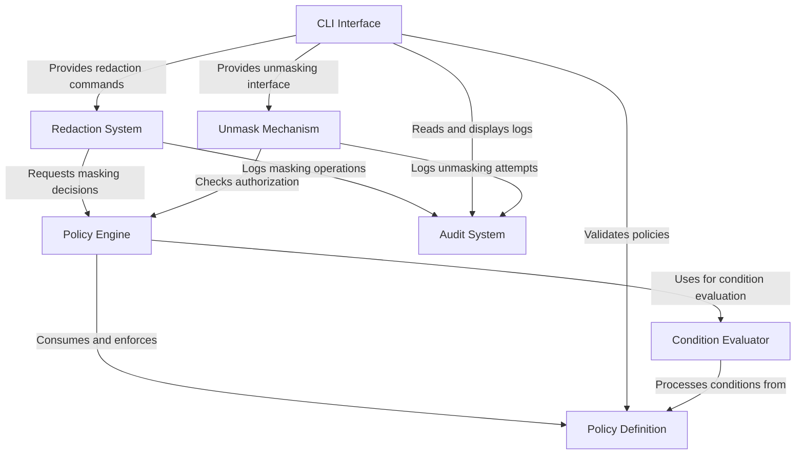

# Tutorial: marvis-vault-oss

**Marvis Vault** is a programmable compliance infrastructure for AI systems that provides secure handling of sensitive data. It allows developers to **define policies** that govern which fields should be masked, which roles can unmask them, and under what conditions access is granted. The system works by intercepting data, applying redaction rules based on policy evaluation, maintaining detailed audit logs of all access attempts, and providing controlled unmasking capabilities. This creates a *security layer* around sensitive information, enabling AI systems to comply with data protection requirements while maintaining functionality.

**Source Repository:** [None](None)

## Chapters

1. [CLI Interface
](01_cli_interface_.md)
2. [Policy Definition
](02_policy_definition_.md)
3. [Policy Engine
](03_policy_engine_.md)
4. [Condition Evaluator
](04_condition_evaluator_.md)
5. [Redaction System
](05_redaction_system_.md)
6. [Unmask Mechanism
](06_unmask_mechanism_.md)
7. [Audit System
](07_audit_system_.md)

---
